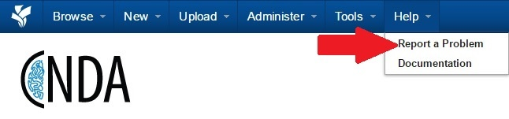
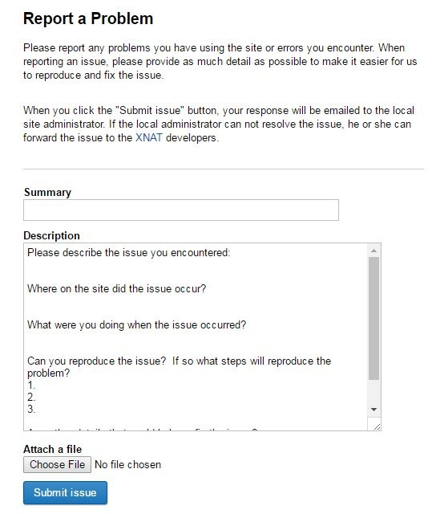
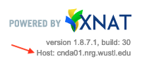

# Contacting the CNDA Help Desk

## Contact Options

### Via the CNDA Site

*Do not use this mechanism if your report (text and/or screen capture) will contain PHI.
Use direct email; see below.*

1. Click the (Report a Problem) link under the Help menu.

2.  Fill out the Report a Problem form.

3. Attach a file if applicable.

4. Click Submit Issue.

### Via email

Send an email to cnda-help@wustl.edu.

*We discourage sending PHI through email, but sometimes it might be necessary to document an issue.
Sending email with PHI from your WUSTL email account to the cnda-help email address is allowed.
Do not send email from a non-WUSTL account (e.g., gmail) with PHI to cnda-help or any other destination.*

### Via phone

The CNDA team no longer has a telephone number.
You are welcome to send a note to the email address above and request a video call.

### Tips for quicket assistance
*Information to Include*

1. On all forms of help requests
 - make sure to include your name and contact information.
2. When requesting new user access
 - make sure to include the project id and what level of access the user should have.
3. When requesting help on data in CNDA
 - make sure to include the project id, subject label and/or session label where appropriate.
4. In cases of functionality; include relevant information to re-create the issue of concern.
 - Please include the data/time the issue occurred if you have that information.
 - Please include the CNDA host for web browser issues. See the bottom right part of the XNAT web UI.
 
 

