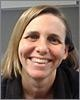
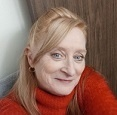

# People of the CNDA

## Jenny Gurney

Jenny completed her MS in computer science right here at Washington University. She also has a somewhat disused BA in Spanish literature from UNC-Chapel Hill (Go Heels!). A refugee from the corporate world, Jenny is thoroughly enjoying her job as a developer and the operational lead (read: “your friendly help desk consultant”) for the CNDA. Jenny is a St. Louis native and enjoys spending time with her husband, family and friends and running/biking endless circles around Forest Park.

## Mary Wolfsberger

Mary joined the CNDA Help Desk in 2019. She completed her AAS in Data Processing-Operations at St. Louis Community College. Mary has worked in radiology research at Washington University School of Medicine since 2005. Mary started in the Electronic Radiology Lab building cancer image libraries and found image data very interesting. She enjoys spending her free time with family and friends, especially her grandchildren.
