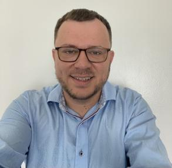

# People of the CNDA

## Jenny Gurney

Jenny completed her MS in computer science right here at Washington University. She also has a somewhat disused BA in Spanish literature from UNC-Chapel Hill (Go Heels!). A refugee from the corporate world, Jenny is thoroughly enjoying her job as a developer and the operational lead (read: “your friendly help desk consultant”) for the CNDA. Jenny is a St. Louis native and enjoys spending time with her husband, family and friends and running/biking endless circles around Forest Park.

## Kenan Kadic

Kenan Kadic joined the CNDA Help Desk in 2024. He finished his Master's degree in English Literature at Saint Louis University, but has since persued Web Development courses through LaunchCode. Prior to WashU, Kenan worked as a Software Support Engineer at Charter, where he helped to resolve issues and build out their moobile platform. He is passionate about troubleshooting and solving problems, and he enjoys spending his free time with his family and friends.
