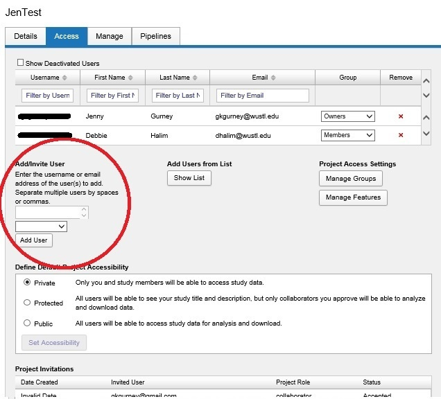
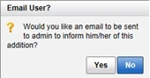
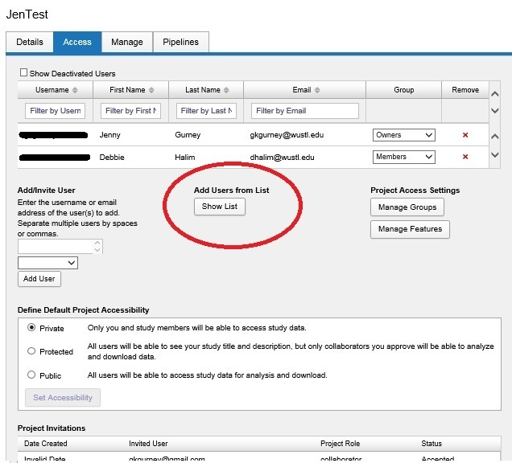
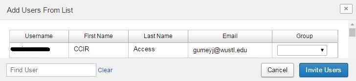

# Add Users To a Project

**NOTE**: To add users to a project you **MUST** have **OWNER** access to that project.

There are two ways to add a user to a project. Both ways are outlined below.

 - Add user to project by entering email address of user
 - Add user to project by selecting user from list

## **Instructions**
### **Add user to project by entering email address of user**

  1. Open the **Project**.

  2. Click on the **Access** tab.

    
  3. In the text box under **Add/Invite User**, enter in the **email address of the user** you would like to add.

  4. Select the **access level** you would like the user to have from the drop down box located under the field where you typed the email address in.

#### **Access Levels**

 - Collaborator: view/download only

 - Member: view/download, create, and edit

 - Owner: view/download, create, edit, and delete

  5. Click **Add User**.

  6. A popup message will display with an option to send an email to the added user.

### **Add user to project by selecting user from list**

  1. Open the **Project**.

  2. Click on the **Access** tab

  3. Click on the **Show List** button under the **Add Users from List menu** located in the upper middle part of the page.

  4. A window will pop open that will show a list of users.

  5. In this list, select the **access level under the Group column** next to the names of the users you want to have access to this project.

  6. Click **Submit**.

  7. After you have submitted your request, you will be given an option to send an email to the added user.
