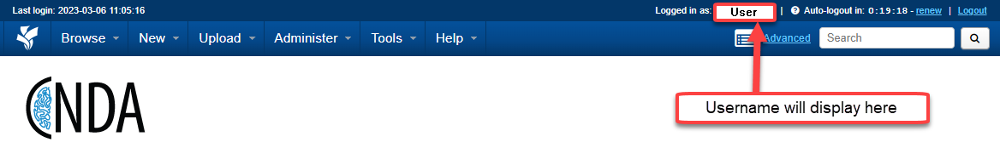
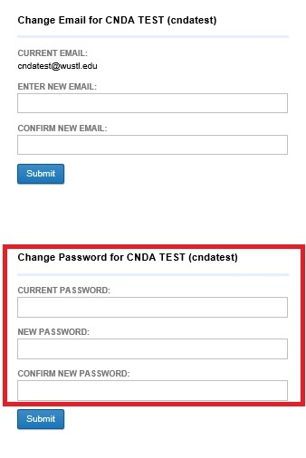

# Changing Passwords

## **Instructions**
1. Log in to CNDA.
2. Click the link for your username to the right of **Logged in as**:

3. Fill out the password information on the bottom part of the form that opens.

4. Click Submit.

**NOTE**: You can also change your email address in this same screen but you will need to submit that change by clicking the Click **Submit** button right below where you entered your new email address. Clicking just one Click **Submit** button will not change both the email and password at the same time.
