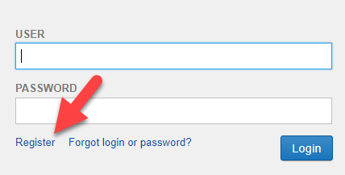
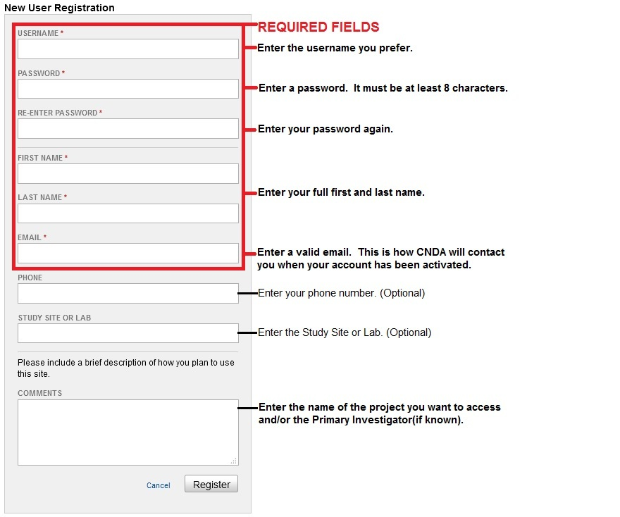
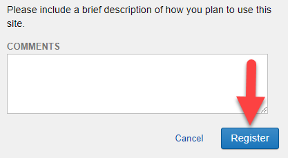

# Register For a CNDA User ID

## **Instructions**

### Step 1: Open the CNDA Website
Using any web browser, go to [https://cnda.wustl.edu/](https://cnda.wustl.edu/).

---

### Step 2: Click the Register Link
Click on the **Register** link located below the password field.

---

### Step 3: Fill Out the Registration Form
Fill out the **New User Registration form** that will open. Required fields are highlighted in the red box below.

---

---

### Step 4: Submit Your Request
Click the **Register** button to submit your request.

---

---

### Step 5: Check Your Email
Once registration is successful, a message will appear stating that an email verification has been sent to you. Check your email and respond to the verification email.

---

### Step 6: Wait for Approval
Your account will be reviewed by the CNDA Help Desk. You will be notified when your account is available for use. The CNDA Help Desk may contact you for additional information before approval.
