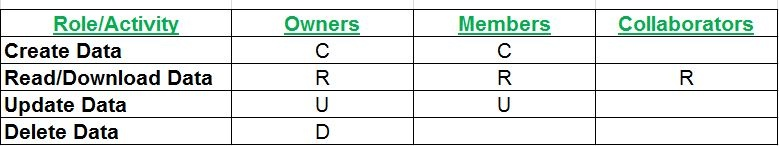
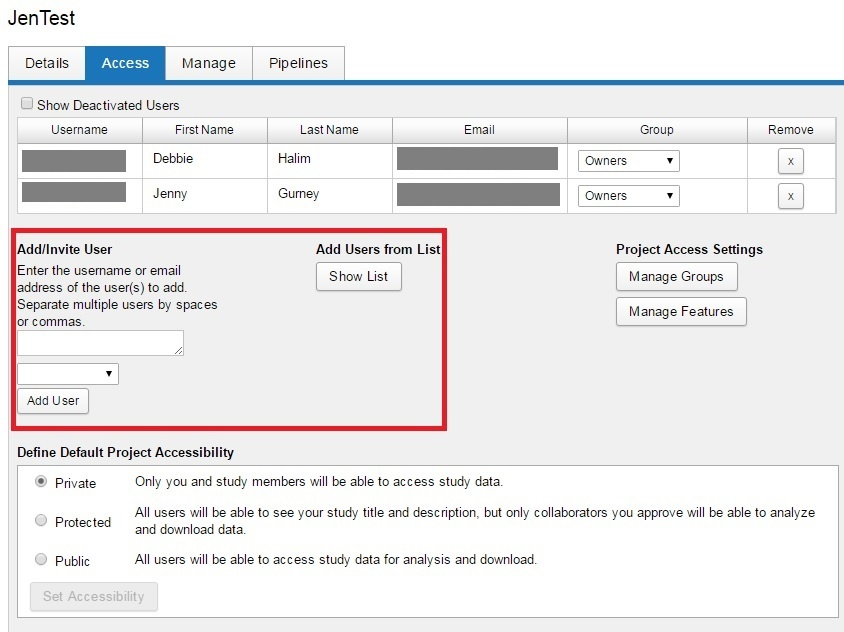

# Roles and Permissions

## **Description**
There are three common project roles in CNDA: Owners, Members, and Collaborators. As a project owner, you have the ability to add specific users to your project within these roles. These users will then have the permissions associated with their defined role.

The "CRUD" model of permissions

 - **Project Owners**: If you define additional project owners, they will have all of the permissions on your project that you do. They can read, insert, modify, and delete anything (and everything) associated with your project. They can also add additional users to your project and modify the data types associated with your project. They can add pipelines to your project.
   
 - **Project Member**s: Members have the ability to manage the data in your project. They can read, insert, and modify subjects and experiments in your project. They can run pipelines. They cannot modify the project users and data types.
   
 - **Project Collaborators**: Collaborators have read-only access on all of the data in your project. They cannot insert or modify data owned by your project. They can download your data and use it within their projects.

## **Managing User Access**
Users can be added to the different roles using the Access tab within the Project Details Screen.

**NOTE**: The **Project Accessibility setting** at the bottom of the **Access** screen in this example is set to **Private**. If you define a **Public** project, it in effect provides Collaborator permissions to your project data for **ALL** logged in users of your XNAT instance.

## **Advanced Users: Sharing data between projects**
The model for sharing data and accessing shared data is a bit more complex than our default user permissions. For more details, see Understanding Data Sharing in XNAT's Security Structure.
