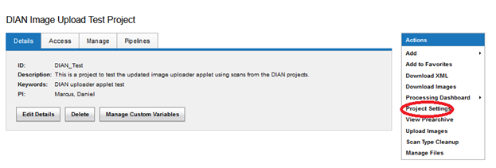
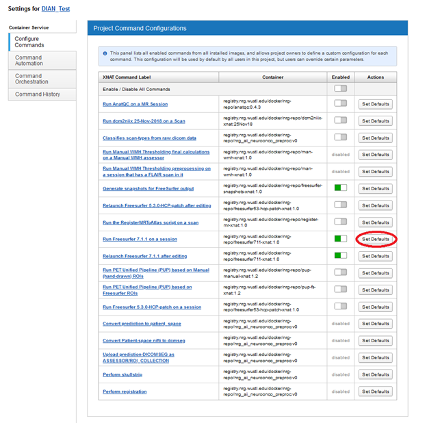
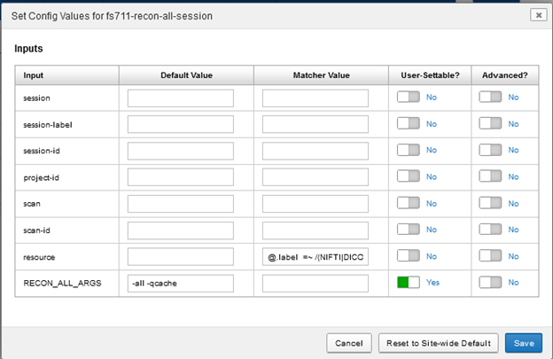
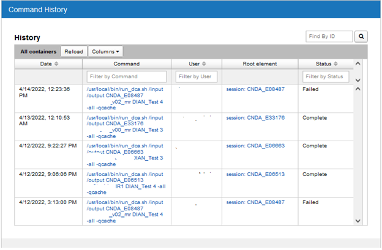

# Adding Docker Containers to a Project

**A user must have "Owner" access to a project in order to carry out the following steps.**  For "Owner" project access, please contact the CNDA Help Desk.

To add a Docker container to your CNDA project, please follow the steps below.

STEP 1:  Click on **Project Settings** in the project **Actions** box.

STEP 2:  On the **Configure Commands** tab, enable the containers you wish to use.

STEP 3:  Click the **Set Defaults** button to view and edit default settings on the container.

STEP 4: To view your containers' progress, click on the **Command History** tab.

