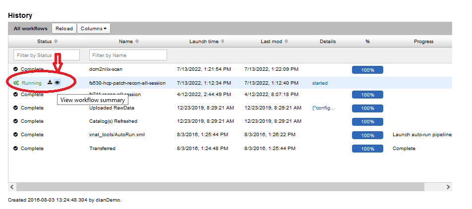

# Running Docker Containers on a Project

**A user must have "Member" or "Owner" access to a project in order to carry out the following steps**.  To check or alter your project access, please contact the CNDA Help Desk.

Docker containers may be run at **session-level** or **scan-level**. To run Docker containers on data in your CNDA project, please follow the steps below.

### I. Running a "session-level" Docker container

A session-level Docker container is launched on the entire session (eg. MR session, PET session, CT session, etc.).

**STEP 1**:  Navigate to a session. In the **Actions** box, click **Run Containers**, then select the container you wish to run on the session.

**STEP 2**:  Modify required parameters and any others that should be changed. Then click **Run Container**

**STEP 3**:  Scroll down to the **History** section to confirm that your container was launched successfully. Click on the **eye** icon to see all run information, status and associated logs.

### II. Running a "scan-level" Docker container

**STEP 1**:  Navigate to a session.  Scroll down to **Scans**.  Under the **Run** column heading, select the arrow for the scan you wish to process.

**STEP 2**:  Modify any settings desired and then click **Run Container**.

**STEP 3**:  See STEP 3 above for viewing container execution status.
