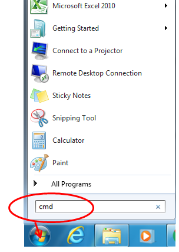

# Bulk Downloads from CNDA to Windows PC

Due to multiple browsers no longer supporting Java applet tools, they are being phased out of CNDA as well, including the Download Images (dir), the bulk session downloader in CNDA. A new version of the tool will be available when CNDA migrates to XNAT 1.7 in a few weeks.

The temporary work around for this is to run a script to download sessions. This allows multiple sessions to be downloaded.

## Instructions
### Install 7-Zip on the pc
1. Download and install 7-Zip on pc if not already installed. It can be downloaded at: **http://www.7-zip.org/**. If 7-Zip is already installed on your pc, proceed to Step 2.
2. Note the location that the 7-Zip program is located on your pc after install as this will need to be added to our script we will use.
   **Batch Script**
3. Download the zipped script file from the link below, that contains the script and csv file needed to download sessions.
   **cndaDownloadSessions.zip**
4. Extract the files.
5. Note the location of the extracted files as this will need to be added to our script.
6. Open up the csv template that was extracted.
7. List the sessions to download in a format where Column A lists the project name, Column B lists the Subject Name and Column C lists the Session Name. See example below.

8. Save and name the document.
9. If you saved the document in a different location, note the path to the document.
### Create Output Directory
10. Create a folder where you want the sessions be downloaded.
11. Note the location of this folder.
### Preparing the Script
12. Open up Notepad.
13. Open up the batch file that was extracted.
14. On line 3 of the batch file modify the XDCPath to match the location of the extracted zip file folder.
    
  **Example for line 3:**
  
Set XDCPATH=c:\Downloads\cndaDownloadSessions

15. On line 4 modify the ZIPPATH to match the location that 7-Zip was installed to.
    
  **Example for line 4:**
  
SET ZIPPATH=c:\PROGRA~1\7-Zip

16. Save the batch file and close it.
    
### Running the Script
17. Open a command prompt by going to **"Start"** (windows button), and typing in **"cmd"** in the “Search files and folders” search field.

18. Press **ENTER**.
19. Your screen will most likely come up to show that you are in a directory similar to this.

20. At the prompt you will type in the command to run the script. The parts of the script are
  a. The name of the script to run
  b. The location of the input file (the .csv list of sessions you want to download)
  c. The location of the output directory (where youw ant the sessions to be saved)
  d. Your CNDA user id
  e. Your CNDA password
The format for typing the command is:

21. Press **ENTER**.

### Checking to See if the Download worked
To check to see if your sessions downloaded follow these steps.

1. In a command prompt, navigate to the folder path you listed as the Output directory.
   
  a. Type in the **letter of the network drive** that you created the output directory in.
  
  b. Press **ENTER**.
  
  c. On the next line type **"cd"**. Add a **space**. Then type the rest of the **path to the location of your output directory**.

2. Once you are in that directory, type **"dir"** to show the contents of that folder
3. Press **ENTER**. You should see a screen similar to the one below. This example shows that a session was downloaded and saved to the H:\cndaDownloadSessions\Sessions folder.

4. To show the files that were downloaded within the session you can type in **"cd"**. Add **a space**. Then type in the **name of the session**.
5. Then press **ENTER**. You should see something similar to the below example. This example shows that this session contains 1 file named 1-localizer.

