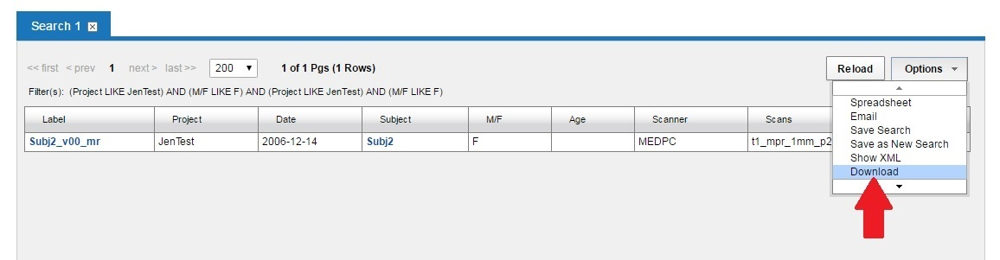
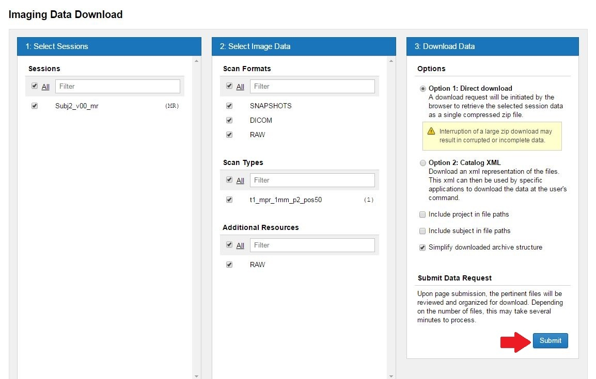

#  Downloading From Search Results

## Instructions

1. Create a Search. See Using an Advanced Search page for assistance.
2. Select **Download** from the **Options** drop-down menu.

3. Make any needed adjustments to the download form.
  
  -Snapshots (under Scan Formats) are often not needed -- Uncheck if so.
  
  -Freesurfers and Rad Reads (under Assessments) are also often not needed -- Uncheck if so.
  
4.Click **Submit** at the bottom of the form.

