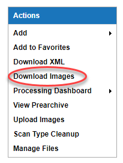
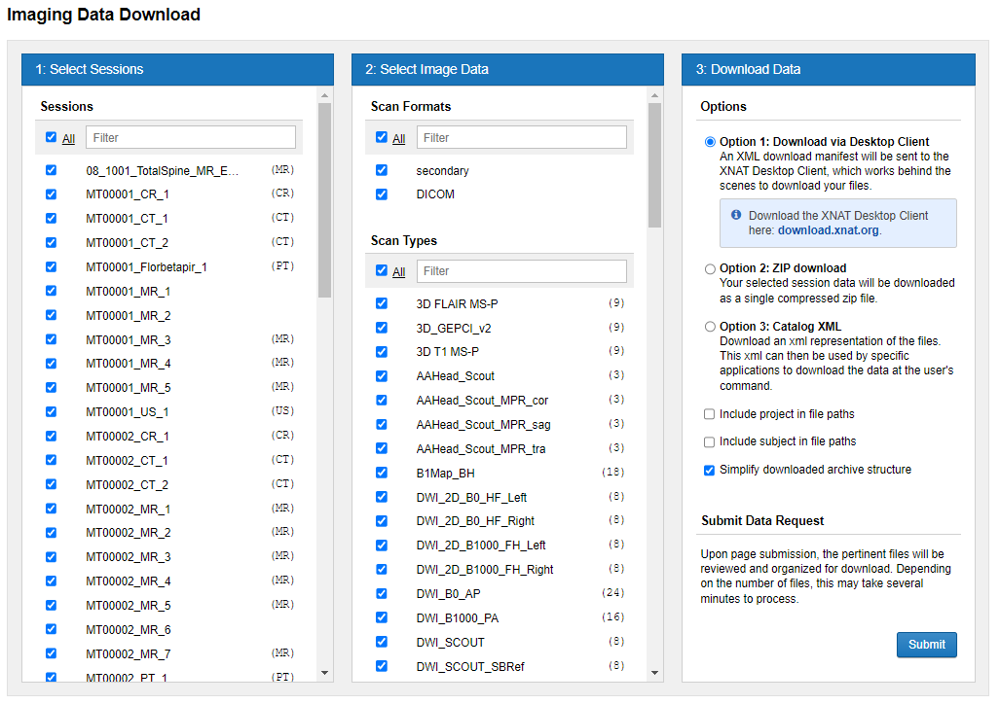
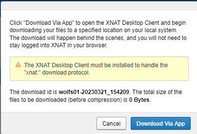
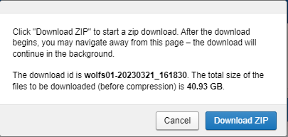

#  Downloading Multiple Images From Project Page

## Instructions
 1. Go to the **Project** page. In the **Actions** box at the top right, click on **Download Images**.

 
 
 2. The **Imaging Data Download form** display.

 

 3. Click check boxes by **Select Sessions needed**.

 4. Click check boxes by **Select Image Data**.

 5. Select **Download Data Options** you want to use.

 6. Click **Submit**.

 7. If you choose **Option 1: Download via Desktop Client**, you will be prompted to click **Download Via App** as seen in the 1st example below or If you choose **Option 2: Zip download**, you will be prompted to click **Download ZIP** as seen in the 2nd example below

 

 
