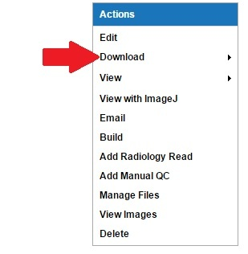
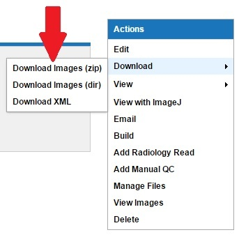
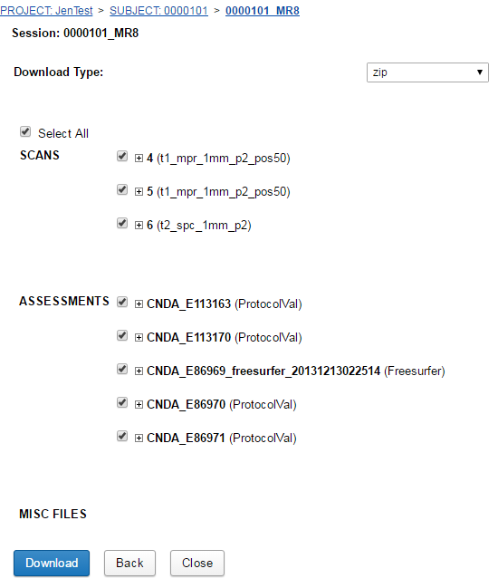
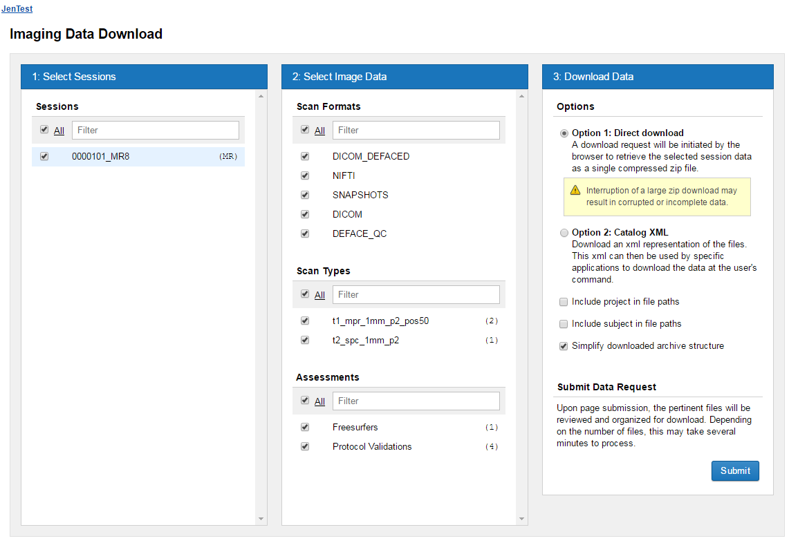

#  Downloading One Image From Session

## Instructions
1. Open the **Session**.
2. Click on **Download** in the **Actions** box at the top right.

3. Choose to download organized in directories, as one large zip file or as an xml file.

   a. Choosing **Download Images (zip)** will take you to a page to select what individual files you want to download as shown below.
   - You can expand each + to show more detail and be able to select/deselect.
   - Choose the scans to be downloaded.
   - Uncheck any unwanted types or formats: Assessments, Additional Resources, and Misc Files. Usually Snapshots are not needed.
     
 **NOTE**: Unchecking these will speed up download time and reduce file size.

   - Once done selecting your files, click **Download**.
   - It will then download your zip file.
     
   b. Choosing **Download Images (dir)** will take you to a page to select what files and formats you want to download as shown below. There are three steps in this process.

   - Select the **Session**.
   - Select **Image Data**.
   - Choose **how to download the data**.
   - Click **Submit**.
   - You will receive a pop up message to confirm downloading the files. Click **Download**.
   - It will then download the zip file.
