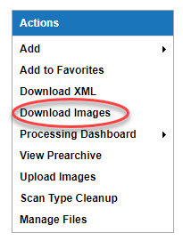
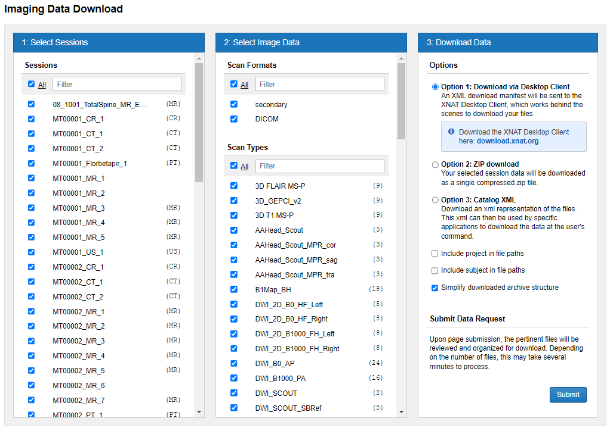
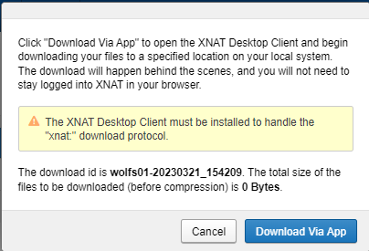
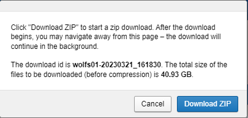

#  Downloading Sessions From CNDA

## Instructions
 1. Go to the **Project** page. In the **Actions** box at the top right, click on **Download Images**.

 
 
 2. The **Imaging Data Download form** display.
   

   **As you can see, this form has 3 columns:**
   - The left column allows you to select which session you need.
   - The middle column allows you to select specific types of scans if searching only for something very specific. If you want everything from a session, leave this unchanged.
   - At the bottom of the middle column you may also see a resource folders for raw data if available.
   - The right column allows you to select your download method.

 3. Click check boxes on left column to **Select Sessions**.

 4. Click check boxes in middle column to **Select Scan Types**.

 5. Click in the right column to select the **Download Option** you want to use.

    **You have 2 main download options here:**
   - If your download is less than 20GB and can complete in less than 30 minutes, I recommend **Option 2: ZIP Download**.
   - Option 2 will come with a preview of size once you click Submit so you will know how big your download is before you start. 
   - If your download is greater than 20GB and cannot complete in 30 minutes, I recommend **Option 1: Download Via Desktop Client**
   - If you choose Option 1, you will have to download and install the XNAT Desktop Client.
   - [How to install and use XNAT Desktop Client](https://cnda-help.wustl.edu/CNDA_User_Guide_and_Tutorials/Uploading_Data/Uploading_Using_a_Desktop_Application.html)
   - [Troubleshooting XNAT Desktop Client](https://cnda-help.wustl.edu/Troubleshooting_Issues_in_CNDA/Troubleshooting_Desktop_Uploader.html)

 7. After picking your download option, click **Submit**.

 8. If you choose **Option 1: Download via Desktop Client**, you will be prompted to click **Download Via App** as seen in the 1st example below or If you choose **Option 2: Zip download**, you will be prompted to click **Download ZIP** as seen in the 2nd example below

 

 
