# Downloading Sessions From CNDA

## Instructions

1. Go to the **Project** page. In the **Actions** box at the top right, click on **Download Images**.

   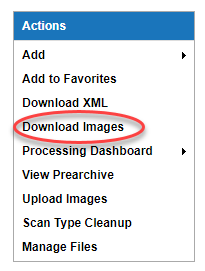

   

2. The **Imaging Data Download form** displays.

   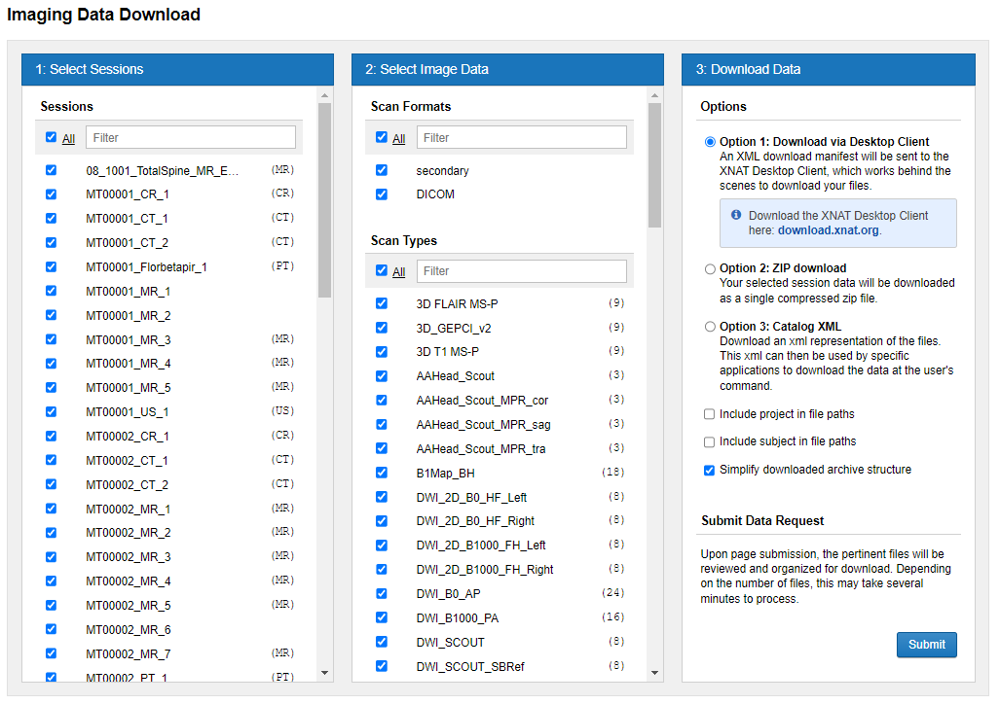

   

   **This form has 3 columns:**

   - The left column allows you to select which sessions you need.
   - The middle column allows you to select specific types of scans if searching only for something very specific. If you want everything from a session, leave this unchanged.
   - At the bottom of the middle column you may also see resource folders for raw data if available.
   - The right column allows you to select your download method.

3. Click check boxes in the left column to **Select Sessions**.

4. Click check boxes in the middle column to **Select Scan Types**.

5. Click in the right column to select the **Download Option** you want to use.

   **You have 2 main download options here:**

   **Download via Zip**

   - If your download can complete in less than 30 minutes (usually for sessions smaller than 20GB), I recommend **Option 2: ZIP Download**.
   - Option 2 is a great choice for smaller downloads.
   - Option 2 has no ability to resume after a failure. If the download fails for any reason, you will have to start over.
   - If you proceed with **Option 2: Zip Download**, you will be shown the download size and prompted to click **Download ZIP** as seen below:

   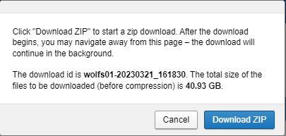

   

   **Download via Desktop Client**

   - If your download is large and cannot complete in 30 minutes, I recommend **Option 1: Download via Desktop Client**.
   - If you choose Option 1, you will need to download and install the XNAT Desktop Client first.
   - The XNAT Desktop Client can resume a download even if it gets interrupted.
   - You don't need all the instructions below, but you do need the info on how to download this application and install it.

     - [How to install and use XNAT Desktop Client](https://cnda-help.wustl.edu/CNDA_User_Guide_and_Tutorials/Uploading_Data/Uploading_Using_a_Desktop_Application.html)
     - [Troubleshooting XNAT Desktop Client](https://cnda-help.wustl.edu/Troubleshooting_Issues_in_CNDA/Troubleshooting_Desktop_Uploader.html)

   - If you proceed with **Option 1: Download via Desktop Client**, you will be prompted to click **Download via App** as seen below:

   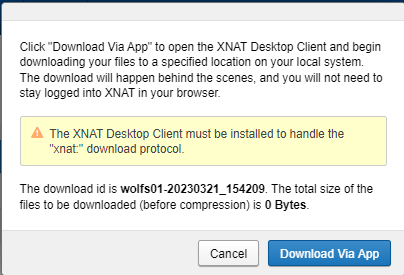

   

6. After picking your download option, click **Submit**.

   **Note:** If you chose Zip Download, this is the end of the process — once you click Download ZIP, your file will save normally through your browser. The remaining steps below apply only if you chose **Download via Desktop Client**.

7. When you press **Download via App**, a new popup page will open. 
   On that page, you have to press **Open XNAT-DesktopClient**. 
   You also have the choice to always allow opening so it does not ask again in the future.

   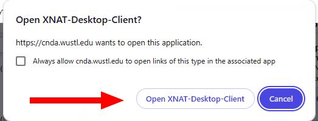

   

8. The Desktop Client will open to a **Download XNAT XML catalog files** window. The **Select XML File** field will already be filled in automatically — the app logs you in and pulls the correct file list through your existing CNDA session, so you don't need to enter any credentials here.

   Click **Browse** next to **Set Destination** to choose where the download should be saved.

   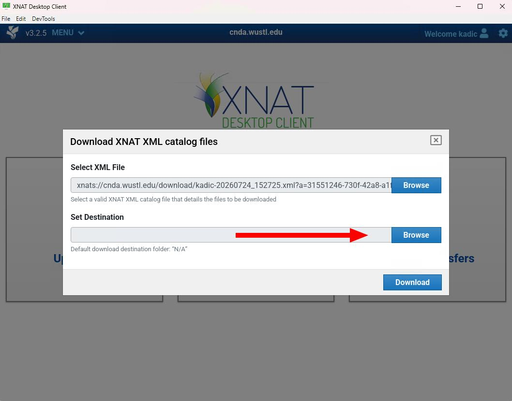

   

9. In the **Select Folder** window, choose the folder you want to save to (for example, a folder on your Desktop), then click **Select Folder**.

   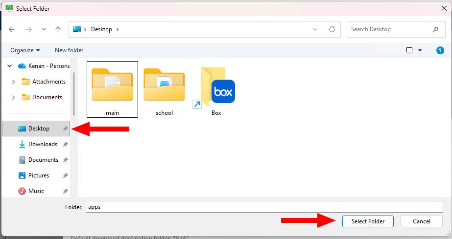

   

10. Your chosen destination now shows in the **Set Destination** field. Optionally check **Set as the default storage location** if you want this folder used automatically next time. Click **Download** to begin.

    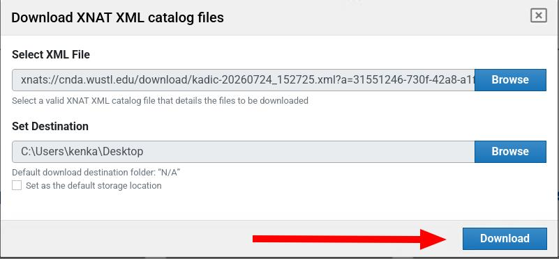

    

11. The **Monitor Transfers: Download** screen shows your transfer in progress, with a green progress bar tracking the file as it downloads.

    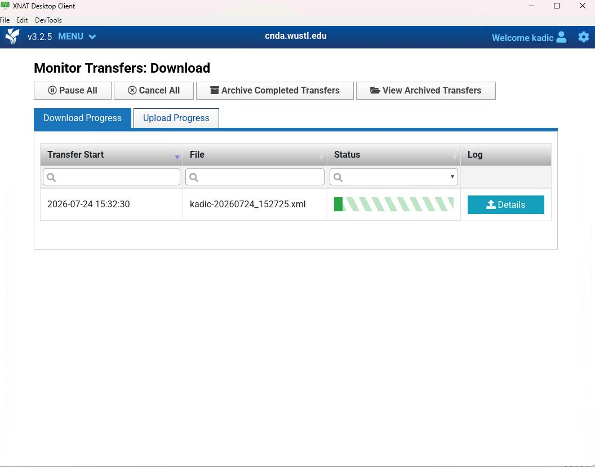

    

12. Click **Details** to see a full breakdown of the sessions included in your download.

    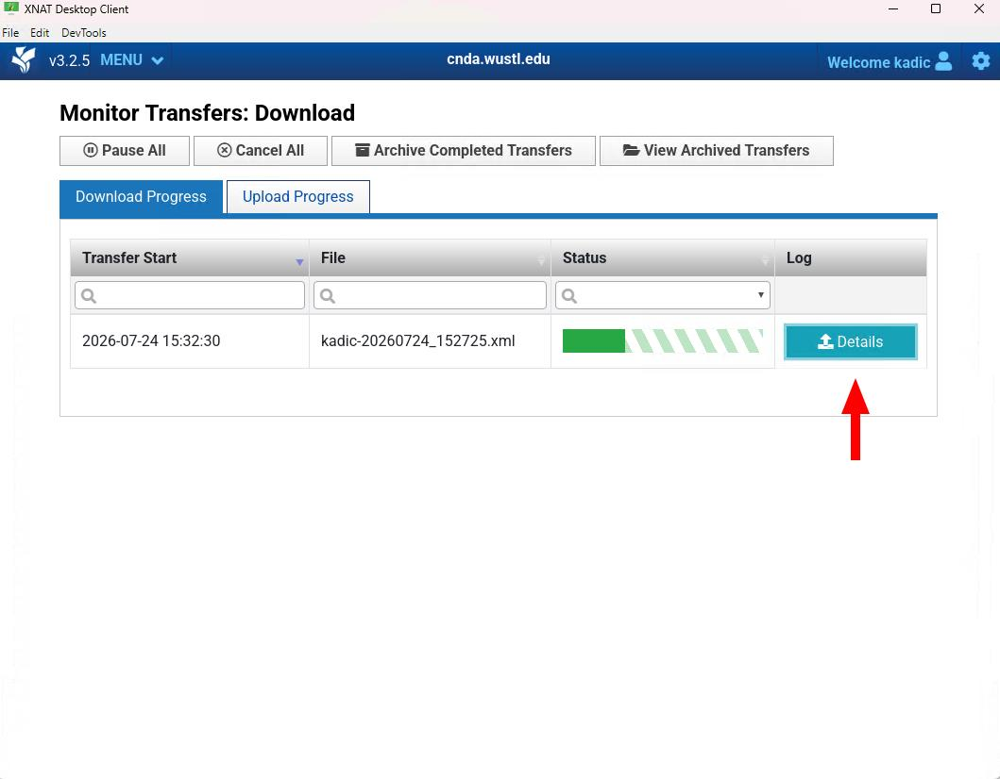

    

13. The **Session transfer details** window lists each session, its scan count, any errors, and its individual download progress. If a session's transfer is interrupted or paused, its progress bar will appear orange with diagonal stripes rather than solid. Click **Restart Download** to resume it — the Desktop Client will continue from where it left off rather than starting over.

    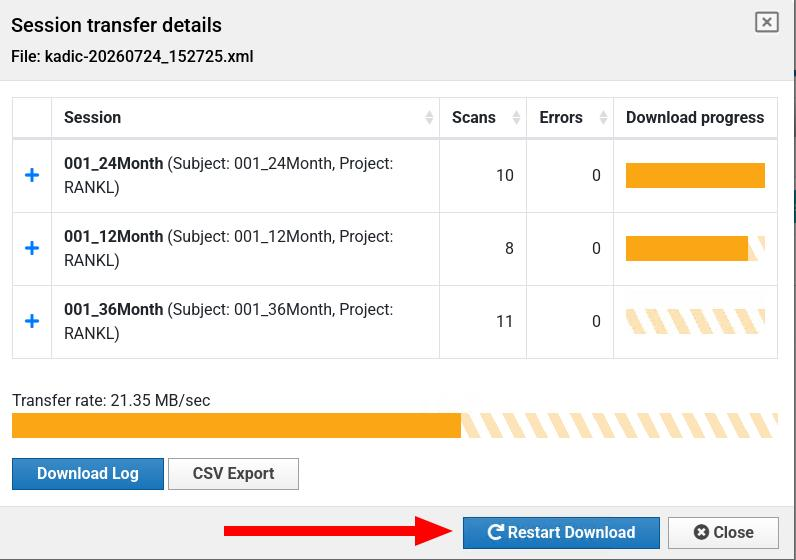

    

14. Once resumed, the progress bar turns green and continues actively downloading, and the button changes to **Cancel Download** — confirming the transfer has restarted successfully.

    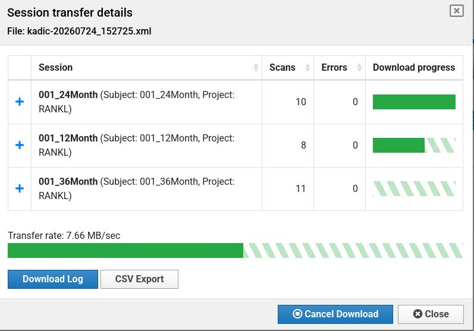

    

15. You should find the downloaded file in your destination folder.

**Note:** If you are ever signed out of CNDA, close the application, or lose your progress for any reason while a Desktop Client download is in progress, you do not need to start over.

- Open the **XNAT Desktop Client** application again.
- Click **Add New XNAT Server**
- For server address you must type in is <https://cnda.wustl.edu>
- Then there are also fields for a username and password.
- Sign in using your CNDA username and password.
- After login ,click **Monitor Transfers** to return to the Download area.

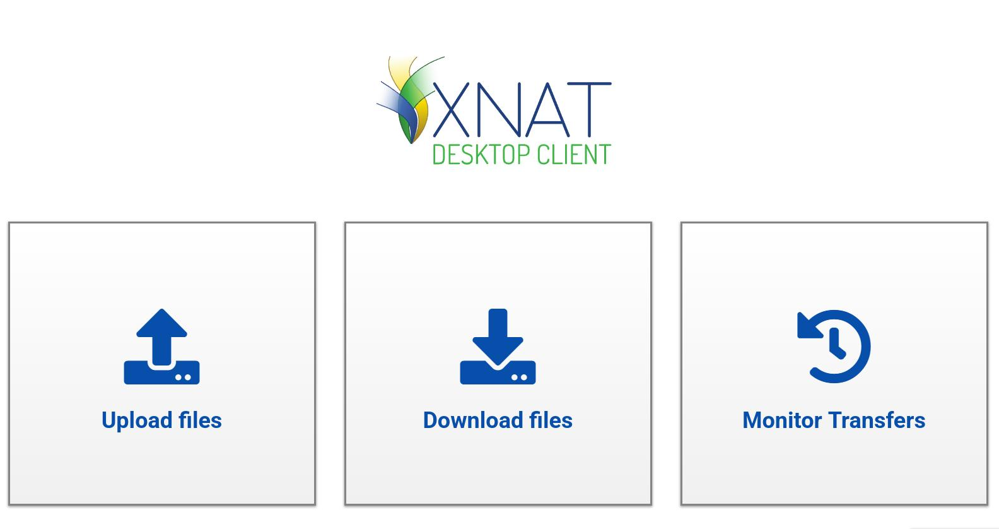

Your in-progress and completed transfers will still be listed here, and any interrupted sessions can be resumed the same way described in steps 13–14 above.
