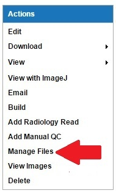
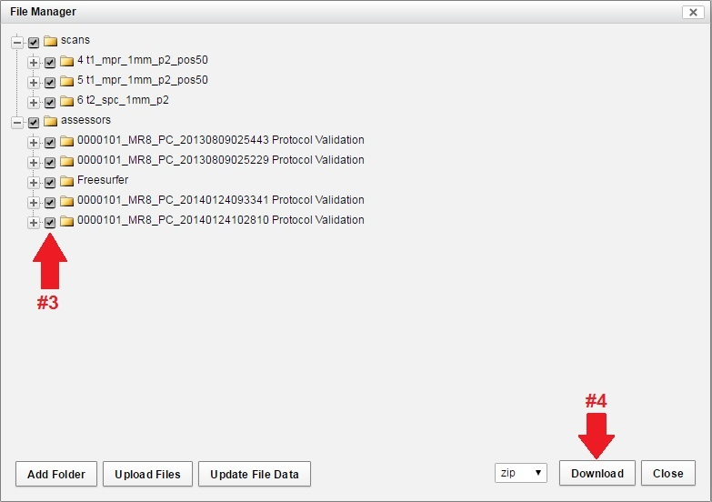

#  Using Manage Files to Download

Downloading using Manage Files allows for easy downloading of images or other files from one session.

## Instructions
1. Navigate to the session details page.
2. Click **Manage Files** in the **Actions** box.

3. The **File Manager** window will open. Uncheck any unwanted files. 

4. Click **Download**.
5. A new window will display.
6. Click **Save**.
7. Click **OK**.
