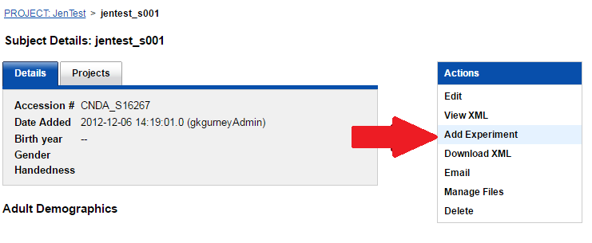
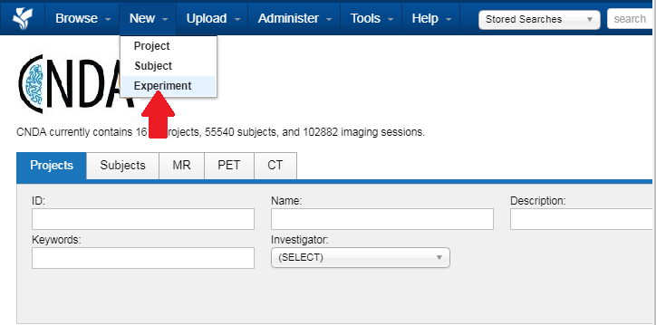
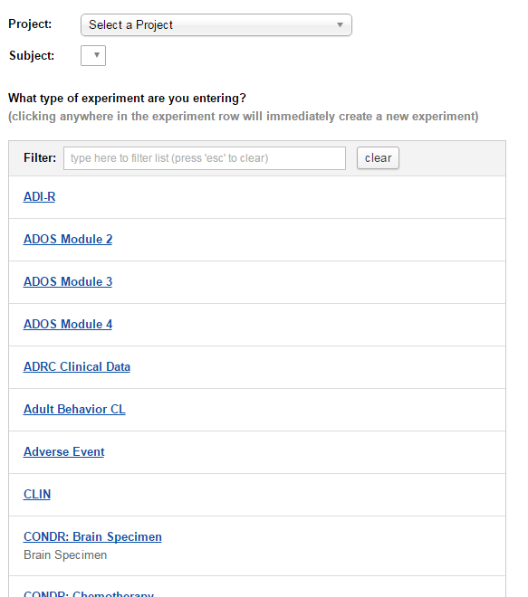
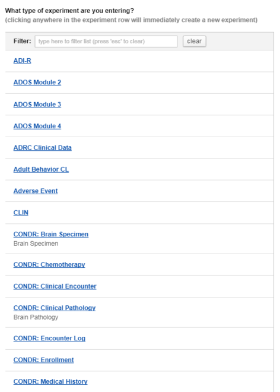
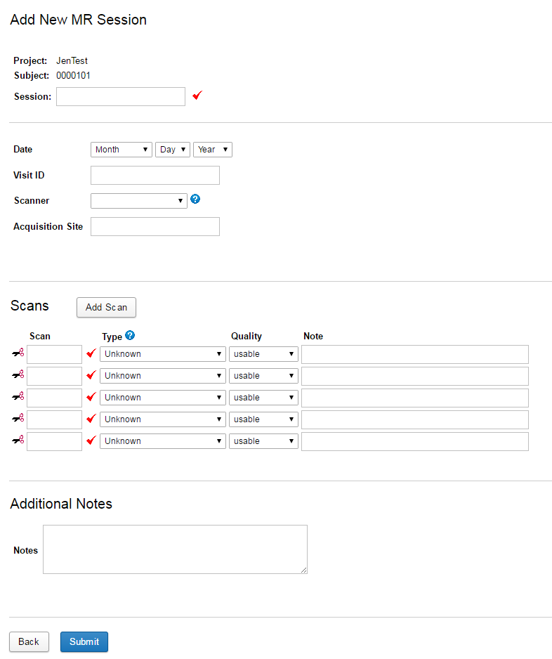

# Adding a New Experiment

There are two ways an experiment can be added to a subject in CNDA. Adding an experiment from within the subject or from the main CNDA menu.

## **Instructions**
### **Adding an experiment from the subject details screen**
 1. Click on the **Add Experiment** link listed in the **Actions** box to the right hand side of the subject details.

 2. A list of available types displays. Select the **experiment type** to be added. To narrow down the list, you can type all or part of the name in the **Filter** text box.

A full list of Non-Image experiments currently available to add to a CNDA project can be found here.

 3. Enter the necessary data on the form that opens.

 4. Click **Submit** to save the experiment when finished.

### **Adding an experiment from the main menu**
 1. Click on the **New** button on the **main menu** at the top of the CNDA home page and select **Experiment**.

 2. Select the **Project** the experiment is for.

    

 3. Select the **Subject**.

 4. Select the **experiment type**. If the experiment to be entered is listed, click the appropriate name. You can also start typing in the name of the experiment in the **Filter** field for faster selection.

 5. A creation form will display.

 6. Enter a unique **Session label**.

 7. Enter session data.

 8. Click **Submit** when complete.

### Examples
### Adding an experiment from the subject details screen
 1. Click on the **Add Experiment** link listed in the **Actions** box to the right hand side of the subject details.

 2. Select the **NIH Stroke Survey** as the type of experiment to be added.

 3. Fill in the form that will open.

 4. Click **Submit** when complete.

### Adding an experiment from the main menu
 1. Click on the **New** button on the **main menu** at the top of the CNDA home page.

 2. Select the **Project** the experiment is for.

 3. Select the **Subject**.

 4. Select **Visit** as the experiment type to be added.

 5. Fill in the form that will open.

 6. Click **Submit** when complete.
