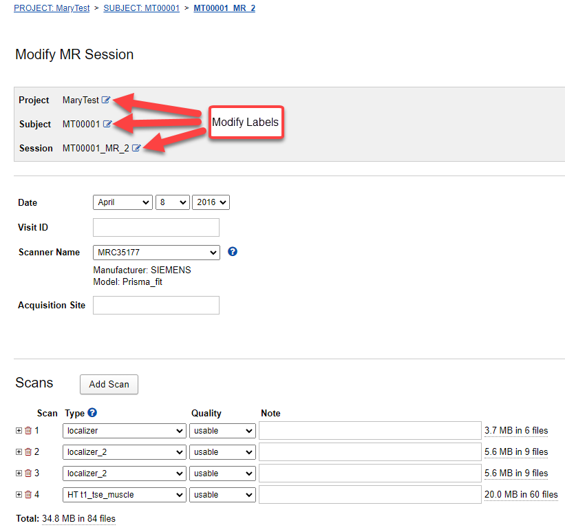

# Session Editing

**NOTE**: Editing a Session requires use of the CNDA Modify Session Form.

## **Instructions**

### **Editing Project, Subject or Session Labels**

1. To access the **Modify Session form**, open a **Session**.
2. Click **Edit** in the **Actions** box.

3. To edit **Project**, **Subject** or **Session** label click the **pencil and paper icon** next to the desired field.

4. Based on selection, one of the following dialog boxes will appear.
   

5. Use the selection box to select something already in the CNDA.

6. For Specific Modifications see below. (Note: User must have Owner access to the current project and Member access to the project to be moved to.)
   
 a. **For Project**:
 - Choose the project to be moved to.
 - Click **Modify**.

 - Select any assessors that need to be moved.

 - Click **Submit**.
 - An alert box will appear. You may see one or two of them as shown below.

 b. **For Subject**:
 - Click the **Create Subject** button to make a new subject.
 - A new window will appear. Fill in the information on the form.

 - Click **Submit**.
 - An alert box will appear as shown below.

 c. **For Label**:
 - Type in the new label.
 - Click **Modify**.
 - An alert box will appear as shown below.

7. When complete, you will be returned to the **Modify Session form**.
8. **DO NOT hit submit.**
9. Click the **Back** button at the bottom of the form.

### **Editing Date, Visit ID and Other Fields**
1. Click inside the text box and type in the changes.
2. Click the drop-down box and select from the list.
3. Click **Submit** when editing is complete.
   
### **Removing Scans**
1. Go to the scans section on the **Modify Session form**.
2. Click the **scissors** icon to the left of the scan to be removed.

3. Click **Delete** in the dialog box that appears.

4. Click **Submit**.
