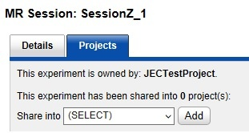
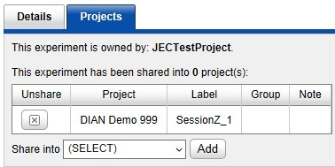

# Sharing a Session Between Projects

## **Description**
A session belongs to one Primary Project, but can be shared into many additional projects. You can ALSO share a session with other projects without sharing the subject that it belongs to. The steps to do this are outlined below.

## **Instructions**
### **Share a Session Between Projects**

1. Go to the **Session's Details page** within its **Primary Project**.

2. Click on the **Project** tab.

3. Select the **name of the project** to share to from the **Share into drop down list**.
4. Click **Add**.
5. In the Sharing Manager window:
   
 a. If you want to share the subject too, leave the check in the subject line and proceed to Step 6.
 
 b. If you **DO NOT** want to share the subject remove the check in the **Share column** for the subject and then proceed to step 6. 

 
 
6. Click **Share**.
   
7. On the **Session details page**, the Projects tab will now reflect that the session is shared.

### **To Remove Sharing**

1. Go to the **Session Details page** for the session you want to remove sharing from.
2. Click the **Projects** tab.
3. In the **share table**, click the X in the **unshare column** to remove the share to the project listed in that row.
 
### **Additional Information**
#### **Articles**
Running Pipeline on Shared Session
