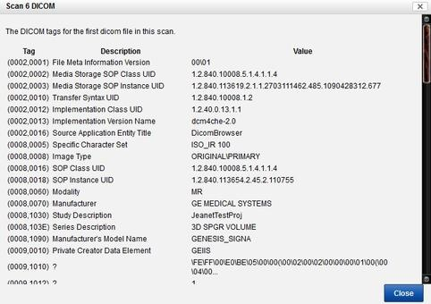
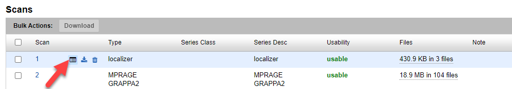
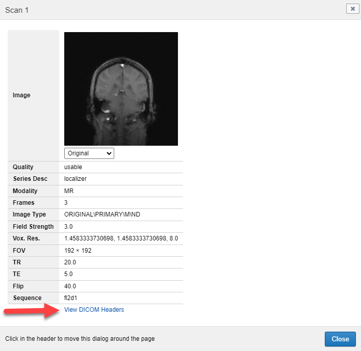

# Viewing DICOM Headers

## **Description**
You can view dicom data two ways in CNDA.  From the session in the prearchive or from the regular archived session.

## **Instructions**
### **View DICOM data for a session in the prearchive**
1. Click the checkbox for the session.
2. Click Details button that displays.
3. Click Review DICOM Tags button.
4. A new window will open displaying the DICOM data.

### **View DICOM data for a session in the project's archive**
1. Open the session.
2. Hover between a scan number and the scan type of one of the scans in the session.
3. Three icons display, select the first one.
4. A window displays, click View DICOM Headers link.
5.  Another window opens with the DICOM Header data.
6.  Close the windows when done.

