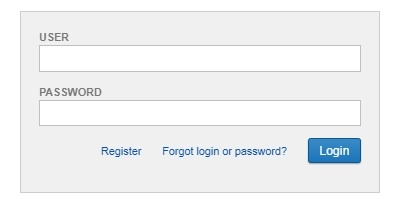
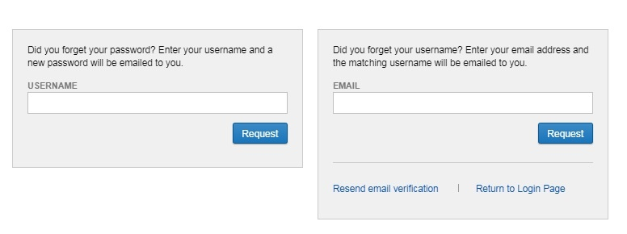

#  Log In to the CNDA

## **Instructions**
1. Go to https://cnda.wustl.edu.

2. Depending on if you are already registered or not follow one of these steps:

 a. Already Registered

 - Enter your **user id** and **password**.

 - Click **Login**.

 b. Registered but need assistance with user id and/or password

 - Click **Forgot Login or Password?**

**NOTE**: Users have up to 5 unsuccessful login attempts before having their user id locked out. It is best to use the **Forgot Login or Password** link before getting locked out.

 c. Not Registered - Click **Register** and follow the steps to register.

## **Things to Remember**
 - After 6 months of inactivity, user id's are disabled. Users can contact the CNDA help desk to have their accounts re-enabled.
 - Users are required to change their password once a year.

