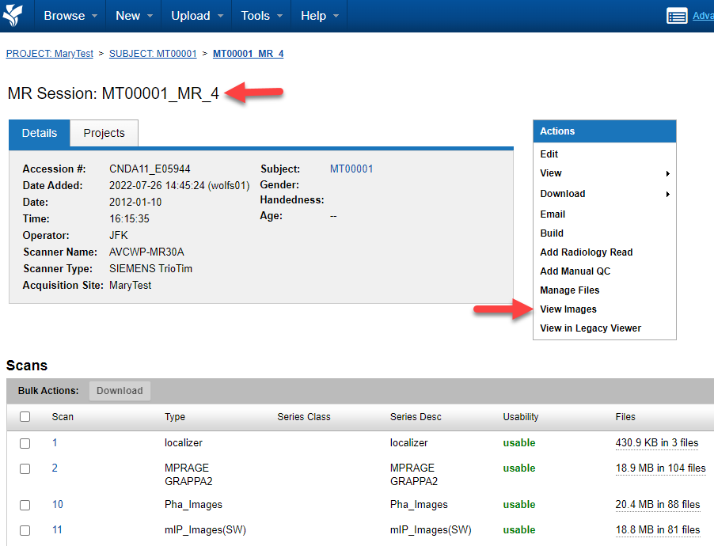
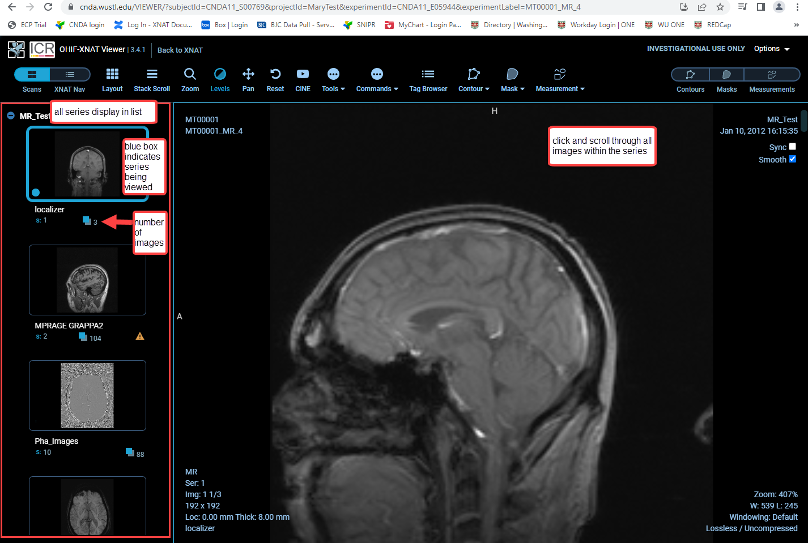

# Viewing Images in CNDA 

## **Instructions**
1. Open the **Session**.
2. Click **View Images** in the **Actions** box on the right side of the screen.

3. The **OHIF-XNAT** Viewer opens.
   
4. All the series within the session display in a list on the left side with a blue box around the first series.
   
5. The first series of the session displays on the right side and is a larger image.
   
6. Use the mouse to click on the series on the right and scroll through to view all the images within the series.
   
7. Click on the next series in the list on the left, the blue box now displays around that series and the images are now on the right ready to scroll through and view.
   
8.The number below each series on the left is the number of images within that series.

