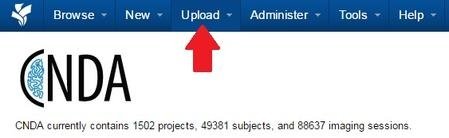

# Accessing & Using the Prearchive

## **Description**

Some examples of why a session might be in the prearchive are listed below.

1. A project can be set to send all new sessions to Prearchive when submitted.
2. A session couldn't be automatically archived.
3. Sessions with duplicate IDs may also be stored here.
   
## **Instructions**
### **Accessing the Prearchive**
There are two ways to access the prearchive:

1. Access from the **Upload** menu on the CNDA home page:
   
   a. Click on **Upload** from the main CNDA home page.

   
    b. Click on **Go to prearchive**.

   
2. Access from a **project details** page.

   a. Open a project.

    b. Click on **View Prearchive** in the **Actions** box on the right side of the screen.

### **Using the Prearchive**
1. Navigate to the prearchive by Step 1 or 2 above.
2. The prearchive screen will display. The **Actions** that can be performed from the prearchive screen are listed below as well as noting their descriptions/locations on this image.

1.  **View**: You can change the view setting to show ALL prearchived sessions, just ones you have checked or if you have opened the prearchive from a project the default view will be filtered to just that project's prearchive.

2.  **Refresh**: Refresh the screen to see a change in status once you have performed an action.

3.  **Check**: After highlighting a session you can click Check to mark a session prior to performing an action.

4.  **Uncheck**: After highlighting a session you can click Uncheck to unmark a session prior to performing an action.

5.  **Check All**: Will check all sessions listed.

6.  **Uncheck All**: Will uncheck all sessions listed.

7.  **Archive**: Send the session to the project archive.

8.  **Review and Archive**: Session parameters can be adjusted before archiving. See Review and Archive a Session from prearchive for complete details.

9.  **Change Projects**: Move session to another project.

10. **Delete**: Remove the session from the CNDA entirely.

11. **Rebuild**: Image data for session can be reset; will recreate the metadata for the session (useful if Status is Error or Conflict).

**The following filters can be applied and are marked with associated numbers in the image above.**

12.  **Projects**: This will already be filled in if you are opening the prearchive from the project details page.

13.  **Upload Date**: You can specify a certain upload date.

14.  **Scan Date**: You can specify a certain scan date.

15.  **Status**: Choose the status of the item(s) you are looking for.

 - **Receiving**: System is still receiving or waiting to make sure the session is complete. It can be reset by clicking Rebuild.
 - **Ready**: The session is in ready state and can have an action performed on it.
 - **Conflict**: Can be reset by clicking Rebuild. This will need to be done before the session can be archived.
 - **Error**: Can be reset by clicking Rebuild. This will need to be done before the session can be archived.
 - **Archive Pending, Build Pending, Delete Pending, Move Pending**: Indicates that the action will occur upon the session when its turn comes up in the queue. Some actions cannot be performed on a session when it is in one of these states.
 - **Archive Now, Building Now, Deleting Now, Moving Now**: Indicates that the action is currently occurring on a session. Some actions cannot be performed on a session when it is in one of these states.
16.  **Subject/Session**: You can specify a certain Subject or Session ID.

17.  **Find my study**: If you do not see your data in the prearchive, you may have uploaded it without associating it with a project. If you want to find your data and move it to the appropriate project. Please enter the Patient Name, Patient ID, or Study Date in the fields below and click the Find button.

### **Review and Archive a Session**
Before archiving a session that is located in the prearchive you can review it and make changes to it.

1. Open the prearchive. Instructions to do this can be found here.

2. Click **Review and Archive**.

3. An **Image Session Creation Form** will display. Changes can be made to many fields on this form.
   
    a. **Subject**: A pre-existing subject can be selected from the drop down list. If a subject is listed that did not previously exist it can be automatically created or a new one can be made.
   
    b. **Session**: You can change the session label here.
   
    c. **Date**: The date can be adjusted.
   
    d. **Visit ID**:
   
    e. **Scanner**: Specifies which machine was used to scan the images.
   
    f. **Acquisition Site**:
   
    g. **Scans**:
   
     - **Type**: Specifies what type of scan it is. **The type of scan has to be selected before the form can be submitted**.
     - **Quality**: Specifies the quality of the scan.
     - **Note**: Any note regarding the session can be input here.
       
    h. **Notes**: You can add notes to your session on this page.

4. Once all necessary changes have been made, click **Submit**.

5. A **Submitting Session** message will appear.

6. The Session Details page will display when archiving has completed.

### **View/Download a Session from Prearchive**

1. Click the **checkbox for the session**.

2. Click **Details** button that displays on the right side of the screen.

3. Click **Review File Details** button OR Click **Download All Files** to download session (skip 4 and 5 below) and follow directions.

4. A window will open with Session information.
5. Click **View Image** to display session images.

### View Dicom Data
To view DICOM data for a session:

1. Click the **checkbox for the session**.
2. Click **Details** button that displays.
3. Click **Review DICOM Tags** button.
4. A window will open displaying the DICOM data.

