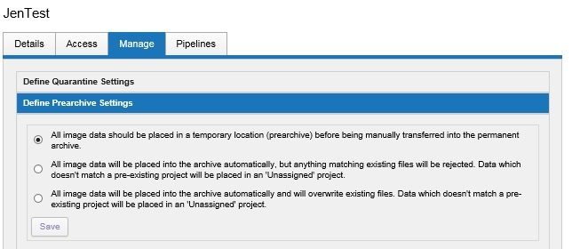
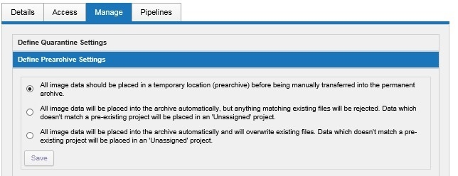
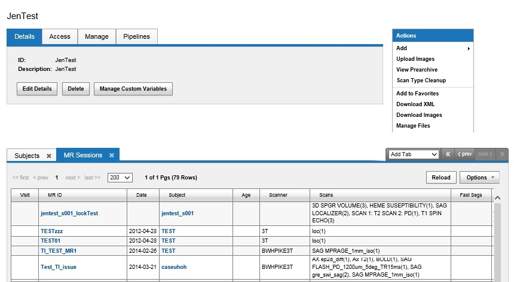

# Archiving Data-Archive & Prearchive Settings.md

There are three options for archiving your uploaded image data, as shown in the screen capture below.

## Project Archive Options
1. Store in project prearchive (option 1 in image)
2. Archive automatically (option 2 in image)
- Does not overwrite any files.
- If the session label already exists, the image data will be sent to prearchive.
3. Archive automatically -- overwrite (option 3 in image)
- DOES overwrite existing files in your archive.
- If the session label already exists, the previous image data will be erased and new data stored.

**NOTE**: With all options above, any image data that doesn't match a pre-existing project will go into an Unassigned project area that can be access by CNDA administrators.

## When to Prearchive
Below, are some guidelines on when to Prearchive or Archive:

### Prearchive
 - A holding area where sessions can be examined before being archived permanently.
 - Sessions in Prearchive are not part of any reports or searches run in/on a project.
 - Sessions that have questionable quality can go here.
 - Sessions that must be manually moved to Archive. An opportunity to verify the session before it is counted with the rest.

### Archive
 - All sessions in Archive can be viewed in detail.
 - Sessions here are counted in all reports and searches.
 - Only good quality sessions in are preferred in the permanent archive ((except in the case of a failed scans project)).
   
Projects that are actively scanning new subjects will use the Prearchive to ensure that no PHI or low-quality data have been inadvertently included in the 
session upload. On the other hand, a project that is uploading archived scan data that has already been vetted might find the Prearchive to be an unnecessary step in the process.

## Instructions
### Setting a Projects Archive Option
To choose your setting for your project:

 1. Click the **Manage** tab on the **Project** page.

 2. Click **Define Prearchive Settings**.

 3. Select the desired option.

 4. Click **Save**.

### Finding a Session that has been Auto-Archived
Sessions that have been auto-archived will be listed within the **Project** under the **Subjects** tab, sorted by subject label.

**Note**: For quicker access to sessions, click the down arrow on the **Add** tab and pick the type of session to view.

In the example below, MR Sessions was selected.

