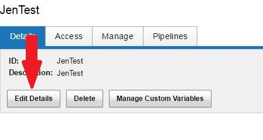
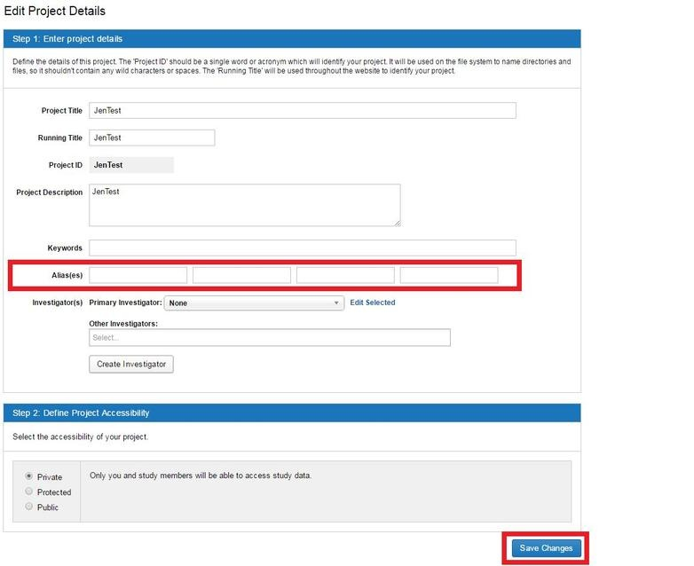

# Adding an Alias to a Project

## Description
**NOTE:** To add an alias to a project you **MUST** have **OWNER** access to that project.

In the CNDA, adding an alias to a project is useful in several respects:

1. It is used by the system to route a session to the correct project.
2. It can help a user when searching for a project.
3. It can account for the occasional typo in a session's project label.
4. It can denote the project's affiliation to a larger group (ex. CCIR, NP).

## Instructions
1. Open the **Project**.
2. Click Edit **Details**.

3. The **Edit Project Details form** will open.
4. Click in a **text box to the right of Alias(es)**. If all are full, erase the text from one box -- this will not remove that alias from the project.
5. Enter the alias you wish to use.
6. Click **Save Changes**.

