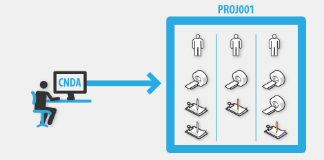
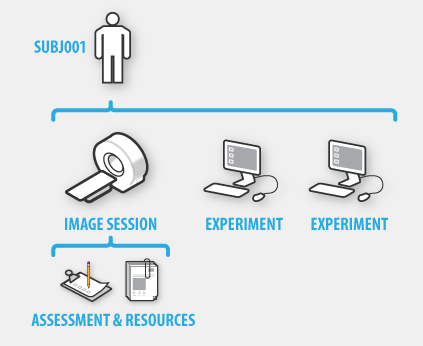

# How project data is organized in the CNDA

In the CNDA, data is organized into projects, and access to your data is controlled at the project level. This makes it easy for PIs and study coordinators to manage who has access to which data in your study. CNDA also provides the ability to share data between projects, which makes it possible to support a wide variety of complex study types, such as multi-site studies. 

**Advanced Users**: Configuring multiple project types (XNAT Workshop 2012 presentation)

Inside a project, data is organized by the following principles:

A **PROJECT** is a collection of **SUBJECTS** and their associated data. If you have project data that is not subject specific, it can be stored at the project level.

A **SUBJECT** is the CNDA term for the participant in a study, whether this be a person, an object (like a scanner phantom), or something else (such as a tissue sample). All subject data in the CNDA **must be de-identified**, as we do not support the inclusion of Protected Health Information. Each part of a study protocol that is performed on a subject is referred to as an **EXPERIMENT**.

In a given **VISIT**, a subject may only be scanned a single time. Or a subject may be given a battery of scans and other experiments (such as clinical evaluations) that last over a multi-day session. Or, in a longitudinal study, a subject may return for repeated visits with follow-up experiments.

Additionally, each image session may be given a series of quality **ASSESSMENTS**, or be run through processing pipelines that add new data as additional **RESOURCES**.

A project in the CNDA can be tailored to account for all of these scenarios.

