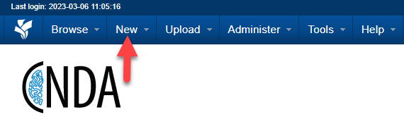
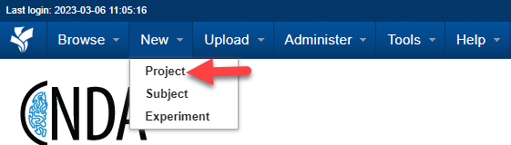
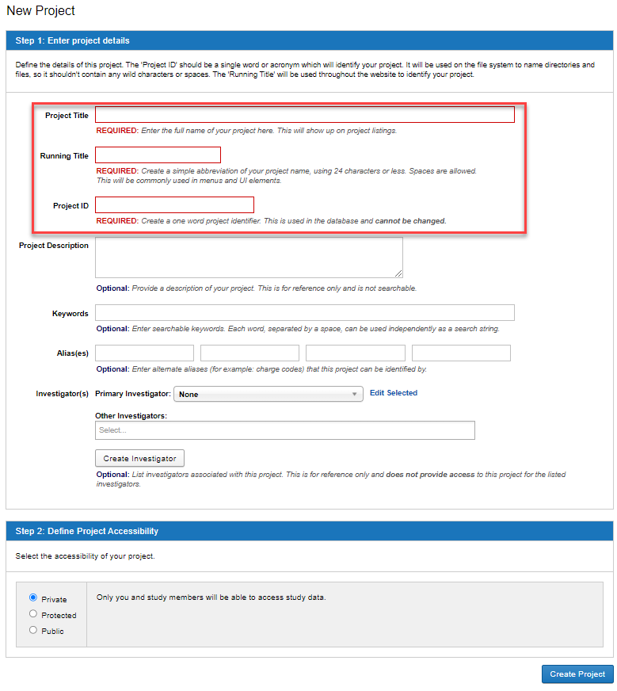

# How to Create a Project

## Description
A new project can be created in CNDA by users with the proper privileges. There are a couple of different options for creating a new project. Both options are listed below.

## Instructions
## OPTION 1 - Fill out CNDA Boarding Form
If your study meets any of the following criteria fill out the CNDA Boarding form and submit to the CNDA Help desk.

Multi-site study
Any ongoing study acquiring data outside WU/BJC
Study requiring customized data type, pipeline, or report development
Studies wishing to share blinded data with outside investigators
Studies requiring protocol validation
Studies wishing CNDA to provide customized user training

## OPTION 2 - Create own project
If your study does not meet any of the above conditions, you are free to create your own project in the CNDA (with a valid owner level CNDA account).

1. Click the **New** menu at the top of the screen

2. Select **Project**.

3. Enter **Project Details**.

  a. **Title: REQUIRED**: Enter the full name of your project here. This will show up on project listings.
  
  b. **Running Title**: **REQUIRED**: A simple abbreviation of your project name, using 24 characters or less. Spaces are allowed. This will be commonly used in menus and UI elements. It can be confusing for users if the 
     Title and Running Title are very different.
     
  c. **Project Abbreviation**: **REQUIRED**: One word or acronym that will be used to name files on the file system. This setting cannot be changed.
  
  d. **Description**: **Optional**: A detailed description of your project. This is for reference only and is not searchable.
  
  e. **Keywords**: **Optional**: A few keywords which describe your project. Each word, separated by a space, can be used independently as a search string.
  
  f. **Alias**: **Optional**: If your project is known by other names or IDs, particularly for accounting purposes, you can enter them here. Alias entries are searchable. Alternate spellings and options that include 
     spaces instead of underscores and vice versa are helpful additions to the Alias field. It ensures that even if the name is input a bit different from the Running Title, the scans will still be assigned to the correct 
     project.
     
  g. **Investigators**: **Optional**: The people who will be investigators for the project. They do not need to be XNAT users and can be added dynamically.
  
  **Primary Investigator**      
  **Other Investigator**
       
  h. Define **Project Accessibility**.
  
  **Private**: Only you and study members will be able to access study data.
  
  **Protected**: All users will be able to see your study title and description, but only collaborators you approve will be able to analyze and download data. Selecting Protected on a project makes it easy for a             user to request access from project owners.
  
  **Public**: All users will be able to access study data for analysis and download.
       
   i. Click the **Create Project** button.
