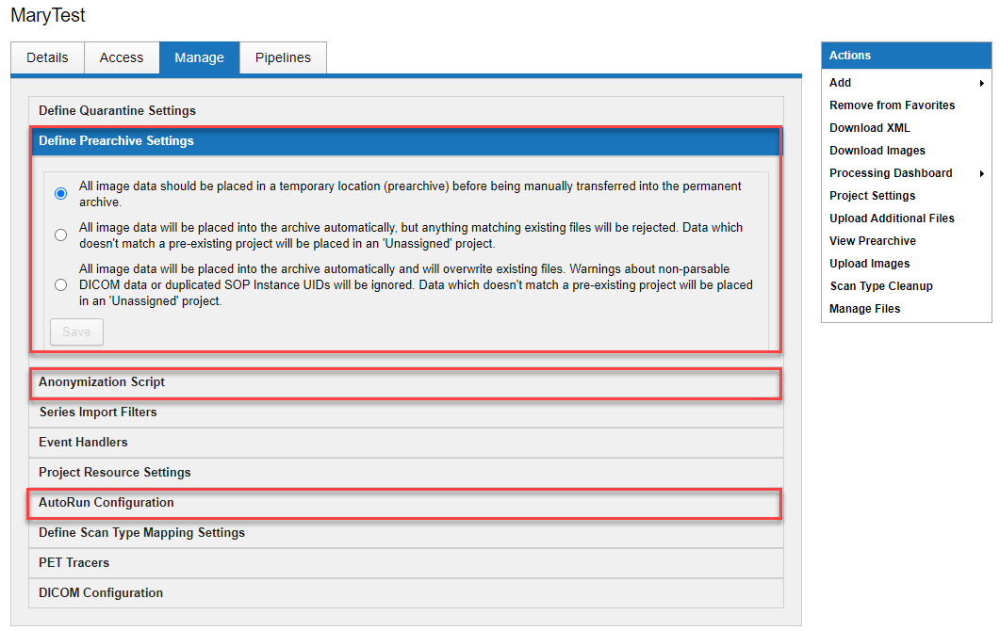

# Managing Project Configurations
**NOTE**: To manage a project you **MUST** have **OWNER** access to that project.

## Instructions
### Managing Project Configurations
1. Open the **Project**.
2. Click on the **Manage** tab.
3. You can modify the following areas:

 a. **Define Prearchive Settings** - There are 3 options for archiving your uploaded data. Choose **ONLY** one.
 - Store in project prearchive - (Option 1 in pic above)
 - Archive automatically - (Option 2 in pic above) This option does not overwrite any files. If the session label already exists, the image data will be sent to prearchive.
 - Archive automatically - overwrite - (Option 3 in pic above) This option **DOES OVERWRITE** existing files in your archive. If the session label already exists, the previous image data will be erased and new data will be stored.
   
**NOTE**: With all of these options, any image data that doesn't match a pre-existing project will go in to an Unassigned project.
 
 b. **Anonymization Script** - The script for anonymizing sessions as they are uploaded to the project will be stored in the large text box. Use of the script can be enabled or disabled by clicking on the appropriate action.
 
 c. **AutoRun Configuration** - Notifications should initially be set up for the project by the CNDA Help Desk. Users listed here will receive email notices any time a new scan is archived in the project.
 
4. Click **Save**.

### Making Changes to Project Details
1. Open the **Project**.
2. While in the **Details** tab, click on the **Edit Details** button.
3. You can edit the following information on the **Edit Project Details** page:

 a. **Project Title**: Name given to the project. This will appear in the list of projects on the home page.
 
 b. **Running Title**: A brief description of your project that will appear in search results and data lists.
 
 c. **Project Description**: A detailed description of your project.
 
 d. **Keywords**: A few keywords which describe your project. Keywords are searchable.
 
 e. **Alias(es)**: If your project is known by other names or IDs, particularly for accounting purposes, you can enter them here. Alias entries are searchable and can be used when scanning a subject.
 
 f. **Primary investigator**: Main investigator on project.
 
 g. **Other investigators**: Other investigators that are involved in the project.
 
 h. **Project Accessibility**:
 - **Private**: Only you and study members will be able to access study data.
 - **Protected**: All users will be able to see your study title and description, but only collaborators you approve will be able to analyze (view) and download data. This option makes it simple for users to request access to your project.
 - **Public**: All users will be able to access study data for analysis and download.
   
4. Once you have made necessary changes, click **Save Changes**.
