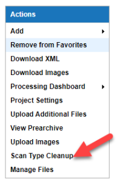
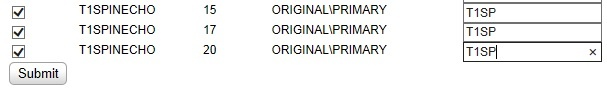
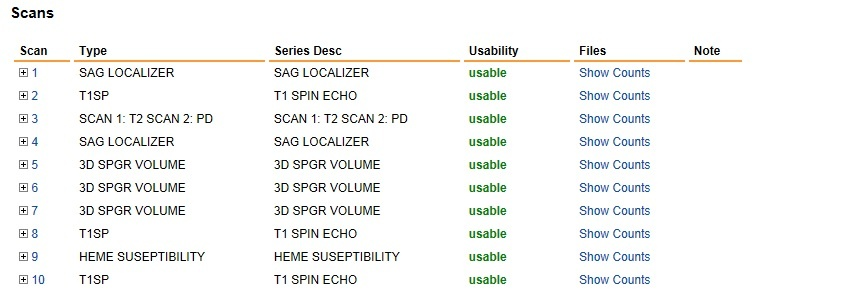

# Scan Type Cleanup

**Note**: This is a project-wide adjustment. It is **Only** available to those with **Owner** access.

## **Description**
When sessions are imported into XNAT, their scan types are defined in the original DICOM files. This can be useful, but it may also contain tiny variations that are no longer relevant to your project. These variations can complicate the process of downloading sessions from CNDA, if you have to hunt down all the variations in the way that scans of similar types can be named.

This feature, new in CNDA 1.6, addresses this issue for project owners by letting you rename scan types after they have been uploaded.

## **Instructions**
### **How to Clean Up Scan Types**
1. Open a **Project**.
2. Select **Scan Type Cleanup** from the **Actions** box.

3. A table displays with listings for all of the scan types within the project.

4. Click the **checkbox** in the **change column** for the row to be renamed.
5. Enter the **new name** in the **Scan Type** column.
6. Click **Submit** when complete.

### **Example: Changing Scan label T1SPINEECHO**

1. From the **Scan Type Cleanup table**, click the **checkboxes** for the T1SPINEECHO entries.
2. Enter a **new label** in the box under **Scan Type** -- we are changing the label to T1SP.

3. Click **Submit**.
4. A Submitting message will appear and then the project details page will reappear.
5. Looking at the Session details page:

   
6. The changes are visible under the **Type** column, while the original label is still showing under Series Desc.
