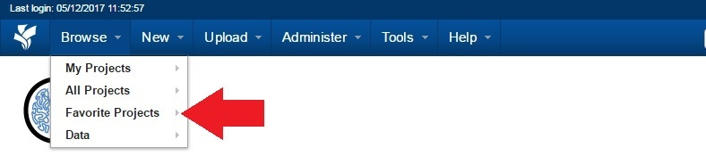

# Setting up Project Favorites

## **Instructions**
### **Add a Project to Your Favorites List**

1. Open the **Project** you would like to make a favorite.
2. Click on **Add to Favorites** from the **Actions** box near the top right of the screen.

### **View Your Favorites list**
1. Click **Browse** located on the top menu.
2. Click **Favorite Projects**.

3. You should see your **Favorite Projects** listed.

