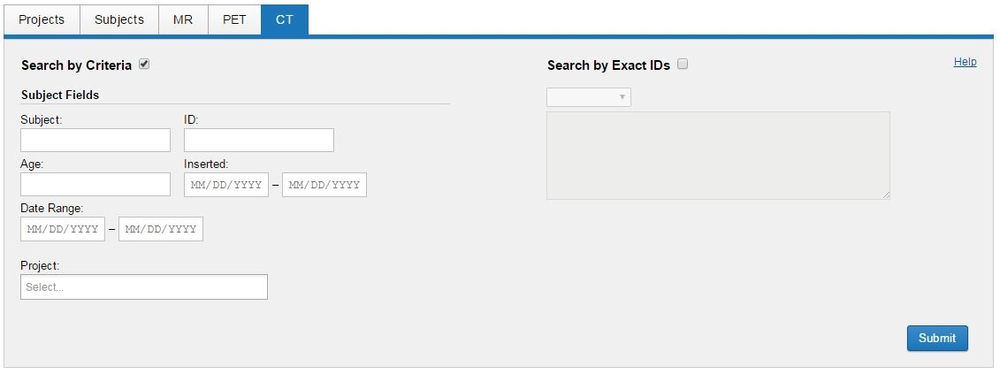

# Generating a Quick Search

From the CNDA home page there are multiple ways to do a Quick Search. These are outlined below.

## **Instructions**

### **Quick Search by Project**
1. From the CNDA home page, click on the **Project** tab.
2. Enter in any of the following information:

  a. Project ID
  
  b. Project Name
  
  c. Project Description
  
  d. Keywords

  e. Investigator
  
3. Click **Submit**.

### **Quick Search by Subject**
1. From the CNDA home page, click on the **Subject** tab.
2. When using the Subject tab to search, you have two options:
   
  a. Searching by Criteria:
   - **Check** the **Searching for Criteria box**.
   - Enter any of the following information:

  1. Subject ID
  2. Cohort
  3. Gender
  4. Hand
  5. YOB
  6. Education
  7. SES
  8. Project Name
     
b. Search by Exact ID's:

 - **Check** the **Search by Exact IDs box**.
 - Click on the drop down box just below that and select **Subject**.
 - In the field underneath that box type in the **Subject ID** you wish to search for.
 - In order to search for multiple id's using this option you must separate each id with a comma.

3. Click **Submit**.
   
### **Quick Search by MR**
1. From the CNDA home page, click on the **MR** tab.
2. When using the MR tab to search, you have two options:
   
  a. Searching by Criteria:
  
   - **Check** the **Searching for Criteria box**.
   - Enter any of the following information:

  1. Subject ID
  2. Cohort
  3. Gender
  4. Age
  5. Session ID  
  6. Date Range
  7. Operator
  8. Scanner
  9. Scan Counts: MPR, FLAIR, FLASH, DTI, TSE and BOLD
  10. Project Name
      
b. Search by Exact ID's:
 - **Check** the **Search by Exact IDs box**.
 - Click on the drop down box just below that and select **Session ID or Subject**.
 - In the field underneath that box type in the **Session ID(s) or Subject(s)** you wish to search for.
 - In order to search for multiple id's you must separate each one with a comma.
   
3. Click **Submit**.

### **Quick Search by PET**
1. From the CNDA home page, click on the **PET** tab.
2. When using the PET tab to search, you have two options:
   
 a. Searching by Criteria:

   - **Check** the **Searching for Criteria box**.
   - Enter any of the following information:

  1. Subject
  2. Cohort
  3. Gender
  4. Age
  5. PET ID
  6. Tracer
  7. Date Range
  8. Project Name
     
  b. Search by Exact ID's:
  
   - **Check** the **Search by Exact IDs box**.
   - Click on the drop down box just below that and select **Session ID or Subject**.
   - In the field underneath that box type in the **Session ID(s) or Subject(s)** you wish to search for. In order to search for multiple id's you must separate each one with a comma.
     
3. Click **Submit**.

### **Quick Search by CT**
1. From the CNDA home page, click on the **CT** tab.
2. When using the CT tab to search by you have two options:
   
  a. Searching by Criteria:
   - **Check** the **Searching for Criteria box**.
   - Enter any of the following information:

  1. Subject
  2. ID
  3. Age
  4. Date inserted
  5. Date Range
  6. Project Name
     
  b. Search by Exact ID's:
   - **Check** the **Search by Exact IDs box**.
   - Click on the drop down box just below that and select **Session ID or Subject**.
   - In the field underneath that box type in the **Session ID(s) or Subject(s)** you wish to search for. In order to search for multiple id's you must separate each one with a comma.
     
3. Click **Submit**.

Once your search results appear you can manipulate them using the Manipulating Search Results and Data Tables instructions.

