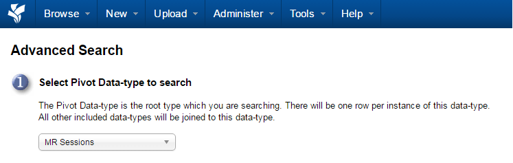

# Generating an Advanced Search

## **Instructions**
 1. To begin an advanced search, click on the **Advanced Search** link on the top right hand side.

 2. The **Advanced Search Steps** will appear.
 3. **Select Pivot Data-type to search**. Select the main type of data to search for.
 
 
 
 4. **Select Additional Data-Types**.
 5. Click **Next**.
 
 
 
 6. The **Advanced Search Criteria** form will open.

 
 
 7. On the criteria form, make any additional needed selections to restrict results.

Common selections include:

 - Selecting a specific project in the Project box (shown here)
 - Selecting a range of dates.
 - Choosing a gender.
   
 8. Click **Submit**.

 9. Search results will be displayed and can be modified. -- see modification instructions.
