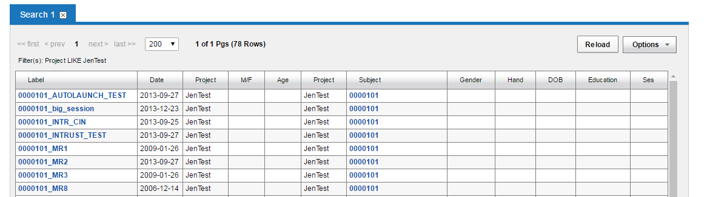
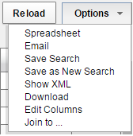
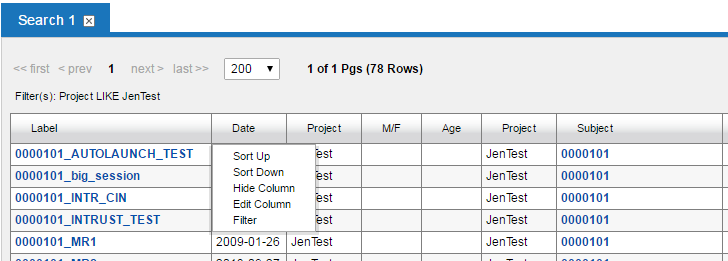
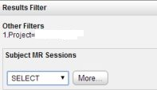
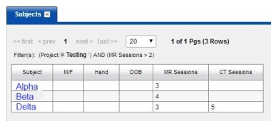

# Manipulating Search Results and Data Tables

You can manipulate data from various places within CNDA. The different areas to do this are listed below.

## **Instructions**
1. Search results from an Advanced Search or within the data shown on a project page will be similar to the example below.

2. Within the search results, data can be manipulated using the **Options** drop-down list on the right.

3. In addition to these options, the columns can be sorted, filtered, edited and hidden. This is done by clicking on the **column header** and selecting the desired action.

### **Common Examples**
### **Sort by Date**
1. Open a **Project** page.
2. Look at the **Subjects** tab.
3. In the upper right of the Subjects tab, click **Options**.
4. Click **Edit Columns**.
5. Click **Inserted** from the list on the right hand side and add it to the **Current Fields** list that is on the left side of the screen.
6. Click Submit.
7. The table should now display the added column.
   
**Note**: You may need to scroll to the right to see that new column.

8. Click on the new **Inserted** column and select **Sort Down** to display the newest data at the top of the list.

**Note**: Once you sort it you will have to scroll over to the right again if you had to do so in step 7.

### **Filter by MR Count Greater Than 2**
1. Open a **Project** page.
2. Look at the **Subjects** tab.
3. Click on the **MR Sessions column header** and select **Filter**.
4. The **Results Filter** window will appear.

5. Under Subject MR Sessions click **Select**.
6. Click the **>** symbol.

7. A new text box will appear to the right. Type **2** in that box.
8. Click **Submit**.
9. The table should now display subjects with 2 or more MR sessions.

