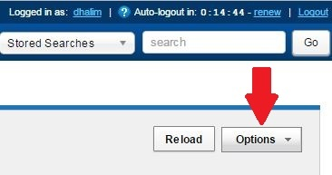
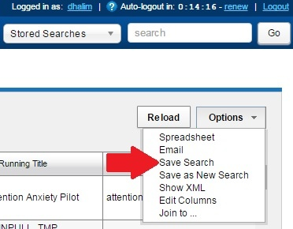
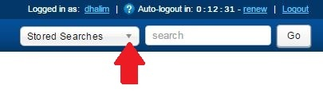
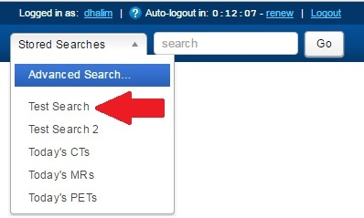

# Working With Stored Searches

After completing a quick search or an advanced search , you can save that search as a Stored Search.

## Instructions

### Creating Stored Search

1. Conduct a **quick search** or an **advanced search**.
2. Make any modifications to the search that are necessary.
3. Click the **Options** drop down box near the top right corner of the page.

4. Click **Save Search**.

5. In the **Save Search Window**, enter an **identical search name** in the **Brief Description** and **Full Description** fields.
**NOTE**: Brief Description will be used as the name of the search.
6. Click **Submit**.
   
### Running Stored Search
1. You can locate and run your stored search at the top of the CNDA main page by clicking on the drop down box that says Stored Searches.

2. Then click on the **name of the stored search you want to run**.

**NOTE**: If you **DO NOT** see your stored search listed in the drop down box **REFRESH** the page and check the drop down box again.
