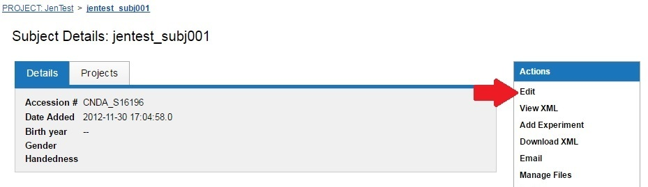
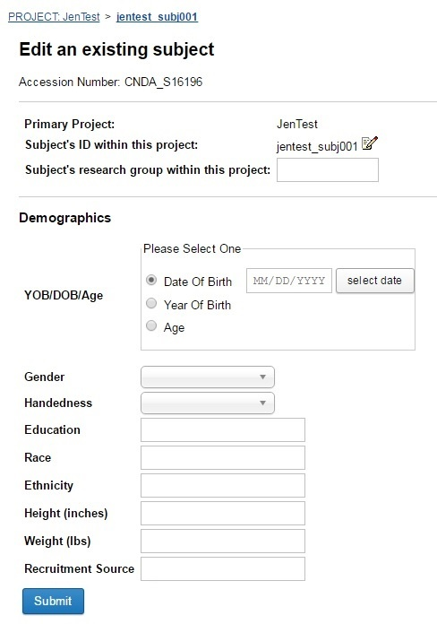

# Edit a Subject

## Instructions

1. Open a **Project**.
2. Open a **Subject**.
3. Click on **Edit** in the **Actions** box on the right side of the screen.

4. Enter the **demographic data**.

5. Click **Submit** when complete.
