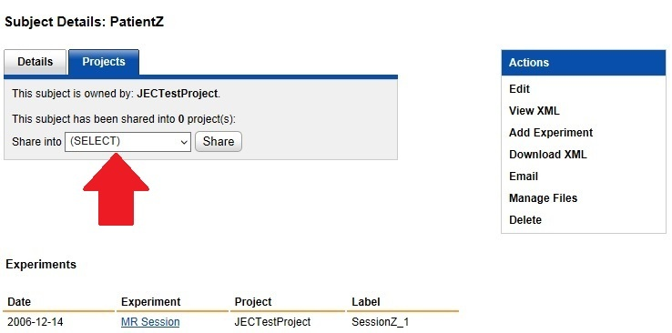
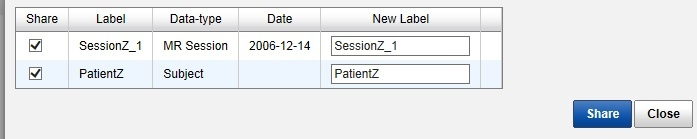

# Sharing a Subject Between Projects

Every subject in CNDA belongs to a Primary Project. However, these subjects can be shared to as many additional projects as needed. They can also be shared without sharing their sessions.

## Instructions

### Share a Subject
1. Open a **Subject**.
2. Click on the **Projects** tab.
3. Select the **name of the project to share** to from the **Share into drop down list**.

4. Click **Share**.
5. Verify that everything is correct in the Sharing Manager window.
  - Any or all sessions can be unchecked to avoid sharing them.
6. Click **Share** to commit the share.

### Remove Sharing
1. Go to the **Subject Details page** for the subject you want to remove sharing from.
2. Click the **Projects tab**.
3. In the **share table**, click the **X** in the **unshare column** to remove the share to the project listed in that row.

### View a List of a Subject's Shares
1. Go to the **Subject Details page**.
2. Click on the **Projects** tab.

3. The share table will display the projects the subject is shared into as well as the subject's label within that project.
