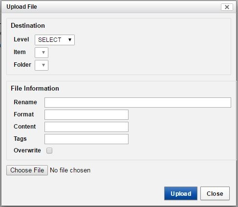

#  Upload a Document Using Manage Files

The following directions are for storing a file such as a spreadsheet or word document directly to the CNDA. These files MUST be completely free from PHI. The file will need to be associated with a session already available.

## Instructions
1. Navigate to a Session Details page.
2. Click **Manage Files** in the **Actions** box.

3. The **File Manager** window will open.
4. Click **Add Folder**.

5. Fill out the form similar to below using an appropriate name in the **Folder** field.

6. Click **Create**. You will be taken back to the **File Manager** window.
7. Click **Upload Files**. Fill out the form similar to below.

8. Click **Browse** and select file to upload.
9. Click **Open** when finished.
10. Rename the file if needed.
