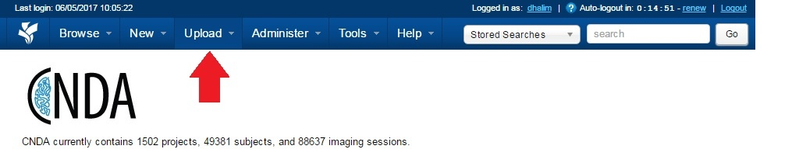
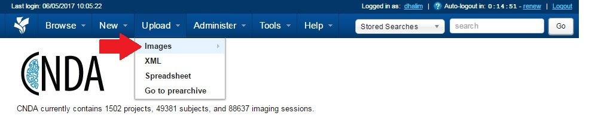
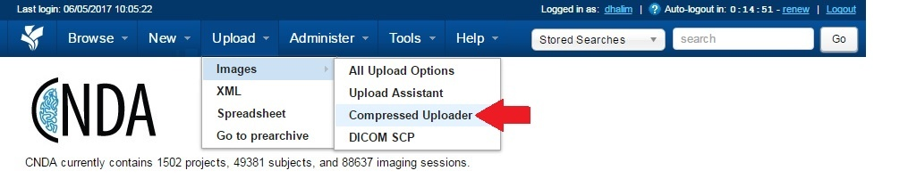
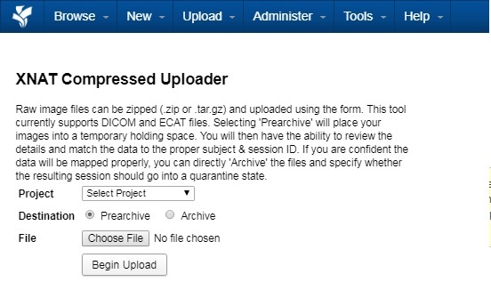

# Uploading Data Using the Zip Uploader

## Instructions
1. Click the **Upload** menu at the top of the CNDA screen.

2. Select **Images**.

3. Click **Compress Uploader**.

4. Choose the **Project**, **Destination** and **File location**.

5. Click **Begin Upload**.
6. When complete, a message will appear with information on the file's new location.
