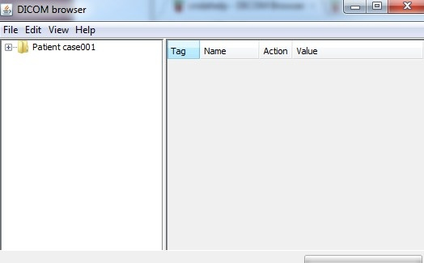
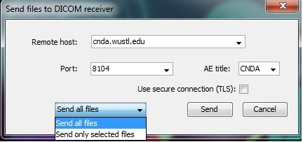

#  Uploading Data via DICOM Browser

## Description
Manually uploading data via DICOM Browser can be used when files stored on a local machine or removable media need to be uploaded to CNDA.

If you haven't already installed DICOM Browser you can install it one of two ways:

Run DICOM from within CNDA

Install from webpage

## Instructions
### Uploading Data via DICOM Browser
1. Open DICOM browser.
2. Open files to upload.

3. Select the **File** menu.
4. Click **Send**.
5. A box will pop up. Fill in the information as shown below:
   
  a. **Remote Host**: cnda.wustl.edu
  
  b. **Port**: 8104
  
  c. **AE title**: CNDA
  
  d. **Uncheck** the **Use secure connection (TLS)** box.
  
  e. Select either **Send all files OR Send only selected files** in the drop down box on the bottom left.

6. Click **Send**.
