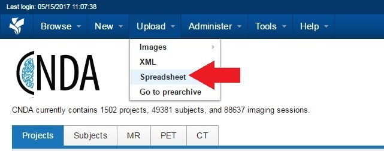
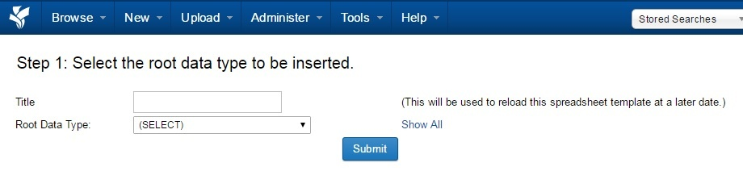
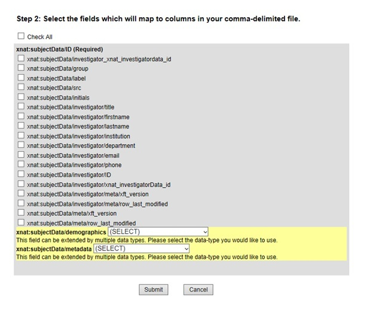
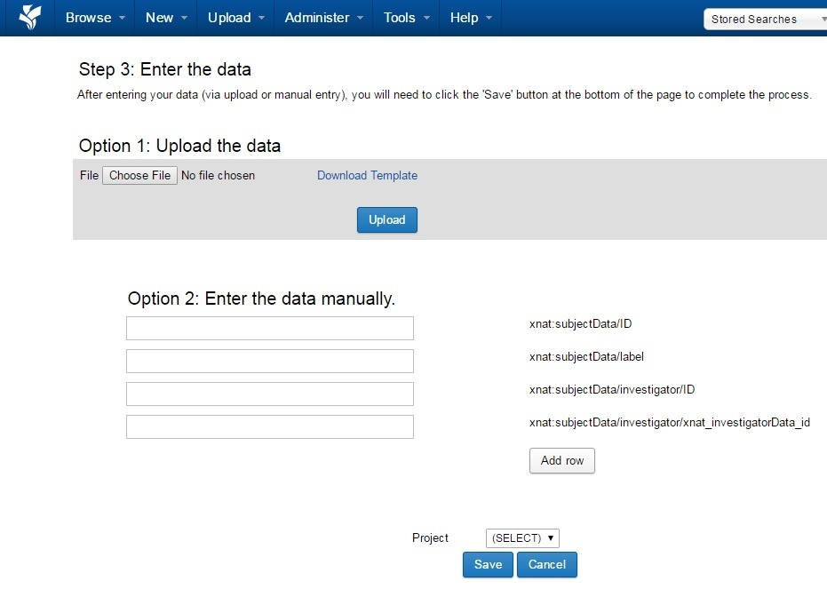

# Uploading a Spreadsheet to CNDA

## Instructions

1. From the **Upload** menu, select **Spreadsheet** to open the form to format the spreadsheet.

2. **Step 1** will appear to select the Root Data Type to be inserted.

3. Enter a **title for the spreadsheet format**.
4. Click the **down arrow** on the **Root Data Type field** to select the Datatype of the entries in the spreadsheet.
5. Click **Submit**.

In the example below, xnat:subjectData was selected as the Datatype.

Alternately, a previously entered spreadsheet format can be selected from the list at the bottom. This will cause **Step 2** to be skipped.

6. In **Step 2**, Select the fields that will correspond to the fields in the spreadsheet to be uploaded.
7. Click **Submit**.
8. In **Step 3** you have 2 options:

  a. **Upload Data**
   - Click **Choose File** to locate the file to be uploaded. It **MUST BE** a CSV file.
   - Click **Upload**.
   - Select the **project**.
   - Click **Save**.

  b. **Enter data manually**
   - Enter your data in the fields provided.
   - Click the **Add Row** button to commit changes
   - Click **Save** when finished.
