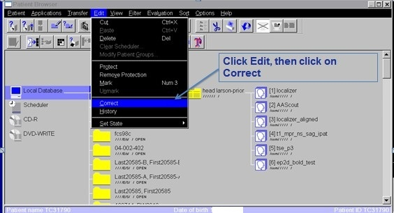
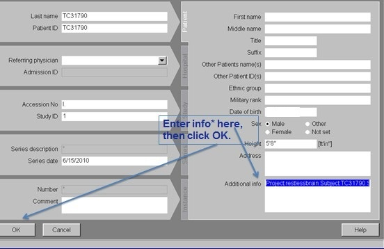
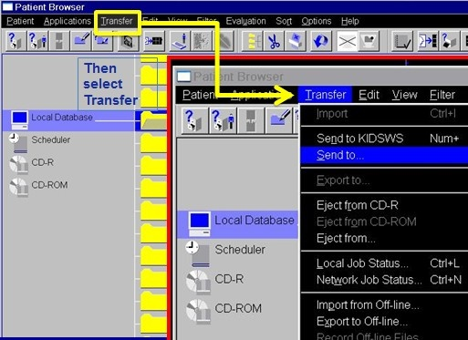
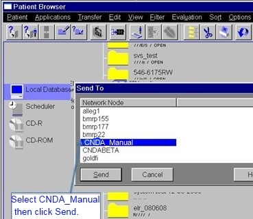

# Uploading Sessions from Bay3

## Instructions

1. In the **Patient Browser, highlight the MR Session** you wish to upload.
2. Go to the **Edit** menu.
3. Click on **Correct**.

4. In the Additional Info field, enter the following information all on one line exactly as shown below. (syntax is very important)

   Example: Project:DemoProject Subject:subj001 Session:subj001_MR1

   Additional Example: Project:DemoProject

Another option would be to just add the project data and omit subject and session.
Project:ProjectIDSubject:SubjectIDSession:SessionID

5. Click **OK**.
6. In the **Patient Browser, select the session** again.
7. Click on the **Transfer** menu.
8. Click **Send To**.

9. Select **CNDA_Manual** from the **Send To** menu.

10. Click **Send**.

