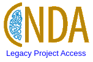

# 2025.04.07 CNDA Gold

The [CNDA Gold](https://cnda-gold.wustl.edu) is now available and provides access to legacy projects.

We have a slightly modified logo to serve as a reminder.

## Who
[Research Computing and Informatics Facility](https://www.mir.wustl.edu/research/core-resources/research-computing-and-informatics-facility/)

## What
CNDA Gold is a read only snapshot of older projects from the CNDA.
Investigators can see their images and other data in this system, but modifications are not possible.
There are more details provided below.

## Where
[CNDA Gold](https://cnda-gold.wustl.edu)

## When
Available April 8, 2025

## Why
1. Unsused projects in the CNDA slow the system for all users.
   - This is an initial step. We will remove these unused projects at a later time.
2. It is time to move the CNDA to a newer storage system.

## What Revisited (More Details)
1. CNDA Gold will inherit the file system (ZFS) that supports the existing CNDA. We are not deleting data.
2. Projects that we have determined to be Inactive will appear in CNDA Gold.
3. A user on a project in CNDA Gold will be listed as a collaborator.
- That status allows one to see the images and other data, but changes are not possible.
4. The projects that are determined to be Active will be found on the CNDA. Users will see no change to these Active projects.
5. To avoid confusion:
- CNDA Gold.
  - Users will see only Inactive projects.
  - Users will not see Active projects.
  - Users cannot upload new data or modify existing data.
- CNDA
  - Users will see only Active projects on CNDA. You will be able to enter new imaging sessions and proceed with your workflow as normal.
  - Users will not see Inactive projects.
6. Contact the CNDA Help Desk if you need to add data to a project that we labeled as Inactive. We can migrate that project if necessary.
7. The CNDA Gold Prearchive is empty. That is part of our plan to have CNDA Gold act as a readonly system.

## What Else is Coming?
1. CNDA and CNDA Gold will coexist on the legacy file system for a short period. We expect to complete the separation in May, 2025. This will require an outage that should take more than an hour but less than a day.
2. We will complete the migration plan by standing up a new CNDA with a database that omits Inactive projects and unused datatypes. This is when users will see a performance improvement. There is no ETA for that step.
