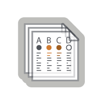
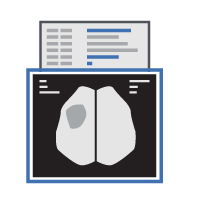

# cnda-help

Welcome to the CNDA Help site, home of documentation and information to help you get the most out of CNDA. 

Need help or want to schedule training? Contact us at 314-286-0549 or cnda-help@wustl.edu.

<table>
 <tr>
  <td> <h3>CNDA Documentation</h3></td>
  <td><h3>Services</h3></td>
  <td><h3>CNDA News</h3></td>
 </tr>
 <tr>
  <td>
About the CNDA

      
CNDA User Guide and Tutorials

      
Troubleshooting Issues in CNDA

  </td>
  <td>
   <table>
    <tr>
     <td></td>
     <td>Image Storage</td>
    </tr>
    <tr>
     <td></td>
     <td>Scripting, Development, and User Manuals</td>
    </tr>
    <tr>
     <td></td>
     <td>Clinical Data Transfer</td>
    </tr>
    <tr>
     <td></td>
     <td>Image Anonymization</td>
    </tr>
   </table>
   See all CNDA Services and Rates
  </td>
  <td>Blog Posts</td>
 </tr>

</table>