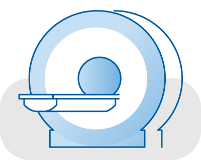
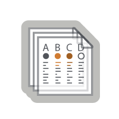

# cnda-help

Need help or want to schedule training? Contact us at 314-286-0549 or cnda-help@wustl.edu.

<table border="0">
 <tr>
  <td></td>
  <td></td>
  <td></td>
 </tr>
 <tr>
  <td><h3 align="center">CNDA Documentation</h3></td>
  <td><h3 align="center">Services</h3></td>
  <td><h3 align="center">CNDA News</h3></td>
 </tr>
 <tr>
  <td>
<a href="About_the_CNDA/About_the_CNDA">About the CNDA</a>

      
<a href="CNDA_User_Guide_and_Tutorials/CNDA_User_Guide_and_Tutorials">CNDA User Guide and Tutorials</a>

      
<a href="Advanced_Topics/Advanced_Topics">Advanced Topics</a>

      
<a href="Containers/Images_and_Commands">Container Images and Commands</a>

      
<a href="Troubleshooting_Issues_in_CNDA/Troubleshooting_Issues_in_CNDA">Troubleshooting Issues in CNDA</a>

      <h3 align="center">Imaging Center Documentation</h3>
      
<a href="Imaging_Center_User_Guides/Imaging_Center_User_Guides">CCIR Imaging Center User Guides</a>

  </td>
  <td>
   <table>
    <tr>
     <td></td>
     <td>Image Storage</td>
    </tr>
    <tr>
     <td></td>
     <td>Scripting, Development, and User Manuals</td>
    </tr>
    <tr>
     <td></td>
     <td>Clinical Data Transfer</td>
    </tr>
    <tr>
     <td></td>
     <td>Image Anonymization</td>
    </tr>
   </table>
   <a href="About_the_CNDA/CNDA_Services_and_Rates">See all CNDA Services and Rates</a>
  </td>
  <td>Blog Posts</td>
 </tr>

</table>
